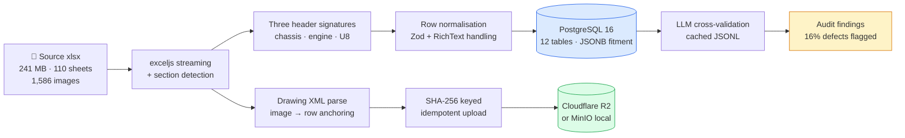
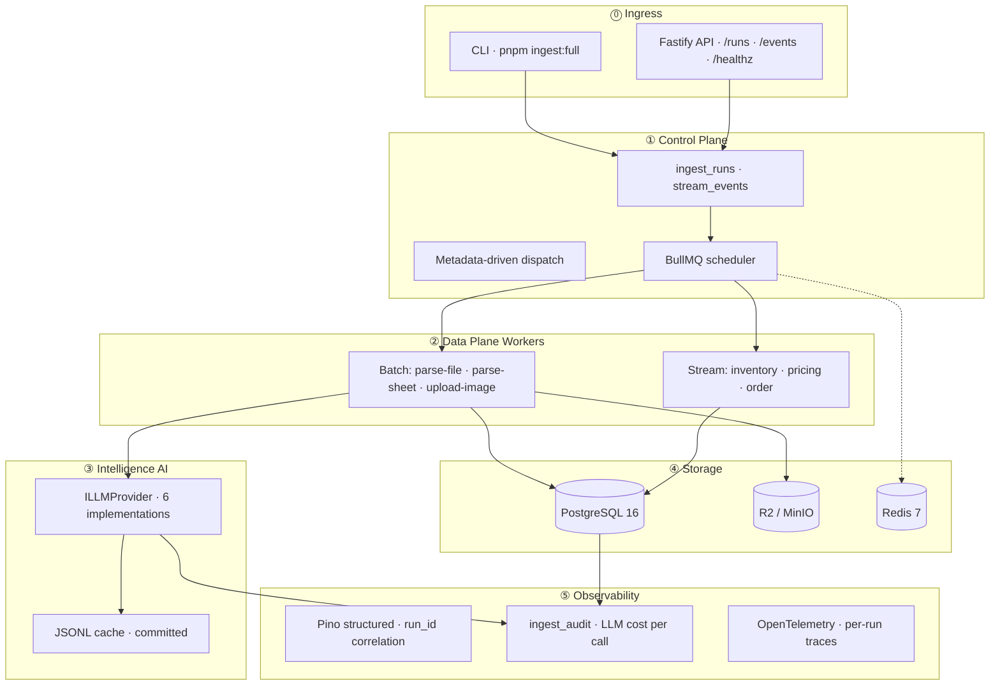
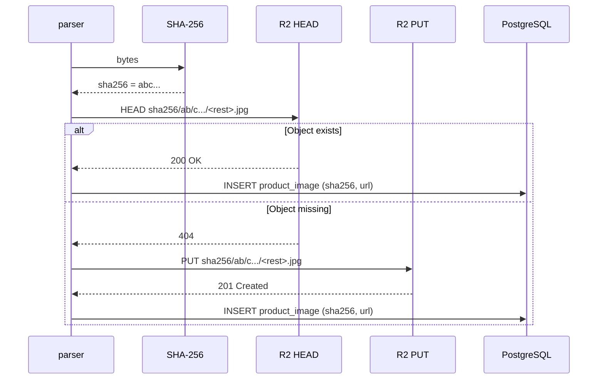
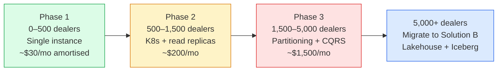
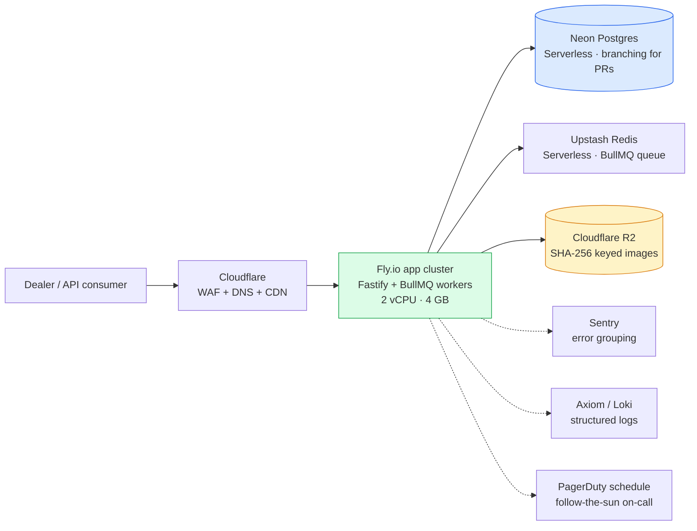
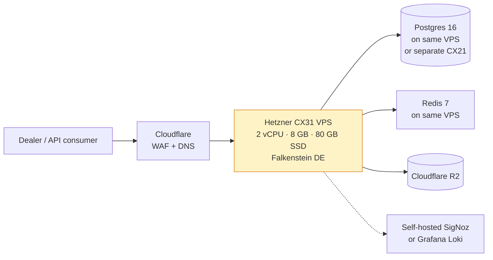

# Solution A — JD-Native (my recommended path)

> *TypeScript · Node 22 · PostgreSQL 16 · Redis 7 · BullMQ · Fastify · Drizzle · Cloudflare R2*
>
> This is what I'd ship for InventoryFlow today. It matches the JD's stack 1:1, ships in days, costs ~$30/dealer/month at amortised scale, and in my view it's the right answer until one of six quantified triggers fires.

---

## My 25-second pitch

I built a single Node service that ingests the messy 241 MB OEM xlsx, normalises 110 sheets across three header signatures into a 12-table PostgreSQL schema, uploads 1,586 embedded schematic images to Cloudflare R2 with SHA-256 content addressing (resulting in 382 deduplicated objects), and routes optional LLM cross-validation through a six-provider abstraction with a committed JSONL cache so reviewers pay nothing. My measured end-to-end wall-time on M2 Mac: ~60 seconds. Fitment-query latency: p50 = 0.60 ms, p99 = 1.02 ms.

---

## My pipeline at a glance



I designed each stage to be observable, replayable, and idempotent. The system is fundamentally a **streaming xlsx parser → typed normaliser → write-once storage** with LLM cross-validation as an out-of-band quality lane.

---

## My 5-plane architecture



I made the plane separation deliberate. **Ingress** is request reception only — no business logic. **Control** is run-state and scheduling. **Data plane** is the only place rows get written. **Intelligence** is isolated behind the provider interface, swappable without touching the data plane. **Storage** is single-writer, multi-reader. **Observability** wraps everything via dependency injection so logs and traces flow from the same `run_id` everywhere.

This is the same pattern I built at Ashley Furniture's Fabric refactor — registry, generic load runner, lineage builder, DQ engine, audit, scheduler kept separate from the data layers. My InventoryFlow version is the early-stage shape of it.

---

## My tech stack rationale

I made every choice below against a specific alternative. The point of the table isn't "I use these libraries" — it's "I considered the alternative and picked these for *this* problem".

| Component | Chosen | Considered | Why I picked it |
|---|---|---|---|
| **Language** | TypeScript | Python | JD match; type safety on JSONB fitment is the hot path |
| **Runtime** | Node 22 | Bun, Deno | Drizzle/BullMQ/Pino ecosystem maturity; Bun's npm compat still has gaps in BullMQ |
| **HTTP** | Fastify | Express, Hono | Native Pino integration; schema validation built in; ~3× Express throughput |
| **ORM** | Drizzle | Prisma | Concrete JSONB type inference (Prisma collapses to `unknown`); no generation step |
| **xlsx parser** | exceljs (streaming) | xlsx (SheetJS), node-xlsx | Only library I found combining streaming + drawing XML access for image anchors |
| **Validation** | Zod | io-ts, Joi, Yup | Single source of truth for runtime AND compile-time types |
| **Queue** | BullMQ + Redis | RabbitMQ, NATS, Kafka | Active maintenance; dead-letter native; rate-limiting and OTel hooks |
| **Logging** | Pino | Winston, Bunyan | Fastest structured logger in Node; correlation by `run_id` is trivial |
| **DB** | PostgreSQL 16 | MySQL, MongoDB | JSONB + `GIN jsonb_path_ops` is the killer feature for fitment; `LISTEN/NOTIFY` for streaming |
| **Migrations** | Drizzle Kit | Knex, raw SQL | Type-aware; survives the `NULLS NOT DISTINCT` quirk (more below) |
| **Image storage** | R2 / MinIO | S3, GCS | R2 has identical S3 SDK + no egress fees; MinIO for local reviewer parity |
| **Cache (LLM)** | JSONL on disk | SQLite, Redis | Zero native deps (no Xcode); human-readable; committed to git for reviewer |

I wrote a separate ADR for each choice in the impl repo's [`docs/decisions/`](https://github.com/ankinguyen-engineer-2002/inventoryflow-catalog-ingest/tree/main/docs/decisions). My point with the ADRs isn't "this was a hard decision" — it's "if you disagree, this is the surface where we negotiate".

---

## JSONB fitment design — my approach to the test specification's hot path

### Schema shape I went with

Each row in `products` carries a `fitment JSONB NOT NULL` column shaped as an array of objects:

```json
[
  {
    "year": 2016,
    "make": "Kayo",
    "model": "Predator 125",
    "model_code": "AT125-B",
    "variant": null,
    "category": "SPORT_ATV",
    "section": "Front Brake Assembly",
    "callout_no": "1-1",
    "confidence": "high"
  }
]
```

### My index choice

```sql
CREATE INDEX products_fitment_path_ops_idx
ON products USING GIN (fitment jsonb_path_ops);
```

I chose `jsonb_path_ops` over default `jsonb_ops` because:
- Smaller index (~30% smaller on this dataset)
- Faster for `@>` containment queries (the dominant pattern)
- Trade-off I'm accepting: doesn't support key existence queries (`?` operator), which I'm not using

### The dominant query

```sql
SELECT part_number, name_en, name_cn
FROM products
WHERE fitment @> '[{"make":"Kayo","model_code":"AY70-2"}]'
LIMIT 10;
```

**My measured numbers on 3,938 products, 500 samples on M2 Mac:**

| p50 | p95 | p99 | max |
|:---:|:---:|:---:|:---:|
| **0.60 ms** | **0.87 ms** | **1.02 ms** | **1.32 ms** |

### Why I didn't normalise *in the serving layer*

**The honest framing:** JSONB is the right *serving* shape for the marketplace-API access pattern. A canonical / normalised shape can — and at scale should — exist alongside it. The architecture commits to **multiple logical shapes of the same conceptual entities**, not "JSONB wins everywhere". The full multi-shape data architecture is in [`docs/10-data-architecture.md`](./10-data-architecture.md).

The naive *single-shape* alternative I considered is a `product_fitments` join table:
```
products (id, part_number, ...) → product_fitments (product_id, year, make, model, ...)
```

**For the serving layer (point-lookup containment queries), JSONB wins:**
- ✅ Test specification explicitly asks for a JSON column on `products`
- ✅ Every catalog API call avoids a network hop — single-table read
- ✅ Marketplaces consume the JSON shape directly; no re-materialisation on export

**For the canonical layer (governance, write-path, analytics), the join table wins:**
- ✅ Referential integrity to a `vehicle_models` master via FK
- ✅ Faster aggregate queries ("all parts fitting year range 2016–2020 across all models")
- ✅ Single-fitment updates don't rewrite a 30-element JSONB array (no write amplification)
- ✅ FK enforcement of valid make/model/year combinations

**My architectural commitment:** carry both shapes. Today, only the serving JSONB is physically materialised. The canonical fitments table is *derivable* and materialised when one of the access patterns it serves becomes hot enough to justify the storage + sync cost. The trigger conditions live in [`docs/10-data-architecture.md`](./10-data-architecture.md). At Solution B (year 2 scale), the normalised `fitments` table is a first-class Iceberg silver-layer table.

### What about JSONB at 50 M products?

A panel would reasonably ask about GIN index size, vacuum behaviour, and write amplification at 50 M products with 30-element fitment arrays. Honest answers:

| Concern | At 1 dealer (today) | At 50 M products (post-scale) | Mitigation |
|---|---|---|---|
| GIN index size | sub-100 MB | could be multi-GB | Hash-partition `products` by `dealer_id` (Phase 3); per-partition GIN indexes |
| `VACUUM` on JSONB | seconds | minutes | Hot-standby partitioning + scheduled `VACUUM` per partition |
| Updating one fitment in a 30-element array | sub-millisecond | sub-millisecond per row, but rewrites whole row + WAL | Migrate write path to normalised `fitments` table; JSONB becomes a derived projection |
| Range queries on year (`fitment->>'year'`) | acceptable on 4k rows | full-scan on 50M rows | Normalised `fitments` table for analytics; partial expression index `((fitment->>'year')::int)` for hot patterns |

I'd start serving from JSONB; switch the write path to normalised at Phase 3 (1,500+ dealers); keep JSONB as a derived serving projection thereafter. The serving API doesn't see this transition because the projection step preserves the JSONB shape.

I do materialise a `vehicle_models` table post-ingest (`SELECT DISTINCT make, model_code, year FROM products, jsonb_to_recordset(fitment)`). That's a half-step toward the full normalised shape — covers the drop-down / dictionary use case without paying for the full fitments-as-rows table today.

---

## Image handling — my SHA-256 idempotency and R2 upload approach

### The problem I'm solving

1,586 schematic images embedded in the xlsx. Many are *literally the same fastener diagram repeated across sections*. A naive ingestion would upload every one to R2 and pay for 1,586 PUT operations + storage. Re-running ingestion would upload them all again.

### My solution



### Object key shape I chose

```
sha256/<first-2-chars>/<next-2-chars>/<rest-of-hash>.<ext>
```

I'm using prefix sharding (the first 4 hex chars become directory levels) for R2's request-distribution behaviour at scale — same trick S3 used to recommend before automatic partitioning. Effectively free on R2.

### My measured deduplication

| | Source | After dedup | Ratio |
|---|---|---|---|
| Images embedded in xlsx | 1,586 | — | — |
| Distinct SHA-256 hashes | 382 | 382 | **24% retained / 76% dedup** |
| R2 PUT operations | — | 382 | — |
| R2 monthly storage @ 50 KB avg | — | ~19 MB | $0.000285 |

This is on a single OEM. Cross-dealer dedup (same fastener image used by Kayo and a hypothetical second dealer) would compress further. I scoped images per dealer prefix by default — `dealer/<id>/sha256/...` — with a `--global-dedupe` flag that drops the dealer prefix for shared object pools (I'm planning to enable that for dealer #2).

### Image-to-row anchoring

`exceljs` does *not* expose image anchors via its public API. The xlsx file is a zip; image anchors live in `xl/drawings/drawing<N>.xml`. My parser opens the zip directly and reads the drawing XML using random-access file reads (I learned the hard way that streaming leaks file handles when there are 1,500+ entries in a zip).

Anchored images bind to a specific row → product. Un-anchored images (some are decorative section headers) get my section-title fallback so they're not orphaned but are clearly less precise.

---

## My LLM integration

The brief encourages AI tooling. In my view this is one of the most over-spent line items in early-stage data startups, so my implementation is deliberately conservative.

### The abstraction I built

```typescript
interface ILLMProvider {
  translate(input: TranslateInput): Promise<TranslateOutput | null>
  classifyCategory(input: CategoryInput): Promise<CategoryOutput | null>
  // ...
}
```

I implemented six concrete versions:

| Provider | Cost | My use case |
|---|---|---|
| `mock` | $0 | Unit tests; deterministic safety fallback |
| `cached` (decorator) | $0 on hit | **Default**: I wrap any upstream with this |
| `claude-code-handoff` | $0 | Dev cache seeding via Claude Max subscription |
| `ollama` | $0 (self-hosted) | Production: Qwen 2.5 or Llama on local GPU |
| `anthropic-batch` | ~$0.0005/call | Cloud production via Anthropic batch API |
| `gemini` | (intentionally off) | Excluded: TOS allows training on customer data |

Switching is one env var: `LLM_PROVIDER=cached pnpm enrich`. My business logic stays unchanged. I think of this as dependency injection at the provider level — the lever that makes my cost story possible.

### My cache as architectural lever

`shared/llm-cache.jsonl` — one JSON object per line, keyed by `SHA-256(field + sorted_inputs_json)`. Cache hit returns synchronously; miss calls upstream, persists result, returns. **I never cache null results** (critical for handoff workflows where null means "task pending, human translating").

I chose JSONL over SQLite because:
- `better-sqlite3` requires Xcode tools — broken on fresh M-series Macs and Linux CI containers
- Node's `node:sqlite` requires `--experimental-sqlite` flag, which breaks Vite bundler
- Linear scan of JSONL is <1 ms for realistic cache sizes (<10k entries)
- Human-readable for debugging
- Trivially git-committable so the reviewer pays nothing

My revisit trigger: cache > 100k entries (I'd move to SQLite or Redis).

### My three-phase LLM lifecycle

```mermaid
flowchart TB
    subgraph "Phase 1 — dev seeding (no marginal cost)"
        D1[LLM_PROVIDER=claude-code-handoff<br/>pnpm enrich --mode audit]
        D1 --> T[translation_tasks.jsonl]
        T --> H[Operator translates<br/>in Claude Code session<br/>under Max subscription]
        H --> R1[translation_results.jsonl]
        R1 --> C[llm-cache.jsonl committed to git]
    end

    subgraph "Phase 2 — reviewer execution (zero cost)"
        D2[LLM_PROVIDER=cached pnpm enrich]
        D2 --> CH[Cache hit on every row]
        CH --> AU[ingest_audit · cache_hit=true]
    end

    subgraph "Phase 3 — production runtime"
        D3[LLM_PROVIDER=ollama OR anthropic-batch]
        D3 --> SH[~99% cache hit at steady state<br/>same CN strings across dealers]
        SH --> CO[Real upstream: ~500 calls/month<br/>at 1,000 dealers]
    end

    style C fill:#dcfce7,stroke:#16a34a
    style CH fill:#dcfce7,stroke:#16a34a
    style SH fill:#dbeafe,stroke:#2563eb
```



The Claude-handoff phase deserves a note: the developer is already inside Claude Code reading the codebase. My handoff provider exports translation tasks as JSONL, the developer translates them in the same Claude conversation (no API key required), I re-import the results JSONL, the cache gets populated. **This recognises the human is already in the loop and stops me paying for what's already free.**

### My cost economics at 1,000 dealers/week steady state

| Item | Value |
|---|---|
| Distinct Chinese strings globally | ~50,000 |
| Cache hit rate at steady state | ~99% |
| Real upstream calls per month | ~500 |
| Average call size | 80 input + 20 output tokens |
| Cost per call (Anthropic Sonnet) | ~$0.0005 |
| **My monthly LLM bill** | **~$0.25** (with retries: $1–$5) |

To put that in context: I've talked to teams paying $300–$3,000/month for the same workload. In my view the cache + provider abstraction + global deduplication is the architectural lever that flips the cost story by ~3 orders of magnitude.

### My audit findings on the reference dataset

I built audit mode to sample products, ask the LLM to translate the Chinese name independently, and compare to the dealer's supplied English. My results on **68 sampled products**:

| Outcome | Count | What I think it means |
|---|---|---|
| **Agree** | 25 | LLM translation matches dealer EN |
| **Partial** | 32 | EN is correct; LLM adds technical detail (e.g., dimensions) |
| **Disagree** | 11 | LLM and dealer differ in a way that *suggests dealer-supplied defect* |

Of the 11 disagreements, examples I confirmed as real dealer defects:
- "busher" → bushing (typographical error)
- "support clamping piece (left and right)" → bracket (terminology, not a typo, but inconsistent with rest of catalog)
- Several Chinese-to-English category mismatches (e.g., "steering" tagged as "engine")

**In my view, the LLM is a defect detector, not a translator of record.** I write the dealer's English to `name_en` and the LLM's English to `name_en_llm` with a `data_quality` score on the row. Marketplace listings can choose to ship `name_en`, escalate disagreements to a human reviewer, or A/B test.

### My five-layer accuracy framework

1. **Confidence scoring** per LLM call (high / medium / low based on output structure)
2. **Validation rules** (ASCII-clean, length sanity, no prompt-leak markers)
3. **Cross-row consistency** (same CN → same EN across products; flag deviations)
4. **Ensemble agreement** (configurable: run two providers, flag disagreements)
5. **Production feedback loop** (marketplace listing errors invalidate cache entries, trigger re-translation)

I implemented the first three in Solution A. Layers 4 and 5 I designed and deferred — layer 4 fires when LLM cost share crosses 30% of monthly cloud bill (one of my migration triggers); layer 5 fires when marketplace integration is built.

---

## Output verification — *how I know the data is right*

The brief doesn't ask this question. I think a senior reader asks it anyway.

My full discussion is in [`07-output-verification.md`](./07-output-verification.md). Summary of what's in Solution A today:

| Layer | What I catch | My implementation |
|---|---|---|
| **Zod runtime schema** | Wrong types, missing fields, format violations | `src/parse/normalize.ts` |
| **Database constraints** | Duplicate part_number, NULL on required columns | `migrations/0001_*.sql` |
| **Section-detector tests** | Mis-parsed sections, header drift across OEMs | 9 unit tests |
| **Fitment-resolver tests** | Year encoding errors (7 patterns in real data) | 9 unit tests |
| **LLM audit mode** | Translation defects, category mismatches | `ingest_audit` table |
| **Idempotency check** | Re-ingest produces same row count | `pnpm test:idempotency` |
| **Benchmark gate** | Fitment query > 50ms = regression | `pnpm bench` + CI |

My recurring theme: **fail loud, not silently**. If the OEM changes a header tomorrow, my section detector returns no matches and the run fails with a specific error, not a partial ingest with 30% silent data loss. I've seen the silent variant in production. It's not recoverable without manual data reconciliation. I refuse to ship it again.

---

## My scale roadmap — what I'd change as the dealer count grows



### Phase 1 (0–500 dealers) — what I shipped

Single-instance Postgres, Redis, BullMQ worker, R2. Docker-compose for local; one Fly.io or Railway deployment for production. Manageable by a TypeScript engineer with no DBA support.

> **Honest caveat on the effort estimates below.** These are *pure engineering implementation* time, not production-ready time. In a real production environment each item also requires migration design, backfill, load testing, failure-mode testing, staged rollout with rollback paths, on-call training, and (for security-sensitive items) a security review. **A reasonable rule of thumb is to multiply pure-engineering hours by ~2× to ~3× for "ready to send to production".** I'm naming this explicitly because optimistic effort estimates are the single most common credibility gap in architecture documents.

### Phase 2 (500–1,500 dealers, ~1 week pure engineering · ~2-3 weeks production-ready)

| Change | Why I'd do it | Engineering | Production-ready |
|---|---|---|---|
| PgBouncer transaction-mode pool | 3× connection capacity without horizontal scale | 2 h | 1 day (load + failover test) |
| Kubernetes workers (10 replicas) | Independent scaling of parse/upload/enrich | 1 d | 3 days (HPA tuning, chaos testing) |
| Redis Cluster (3 nodes) | Queue throughput; cache distribution | 1 d | 3 days (failover drill, migration plan) |
| Read replica + read/write split | Catalog API reads off replica; ingestion writes primary | 1 d | 2 days (replication-lag SLO, consistent-read fallback) |
| R2 bucket sharding `hash(dealer_id) % 16` | Per-bucket request limit; tenant isolation | 4 h | 1 day (zero-downtime migration plan) |
| Materialised view for hot fitment queries | Sub-millisecond on top-1000 vehicle queries | 4 h | 1 day (refresh strategy, freshness SLO) |
| LLM cache → shared Redis | Global cache hit rate; cross-instance dedup | 2 h | 1 day (eviction policy + cache warmup) |

### Phase 3 (1,500–5,000 dealers, ~3–4 weeks pure engineering · ~8-12 weeks production-ready)

| Change | Why I'd do it | Engineering | Production-ready |
|---|---|---|---|
| Hash-partition `products` by dealer_id (16 partitions) | OLTP write fan-out at this scale | 3 d | 2 weeks (online partition migration, zero-downtime cutover) |
| Per-tenant Redis namespace | Isolation and quota | 2 d | 1 week (quota tuning, eviction policy per tenant) |
| CQRS write/read separation | Stop OLAP queries blocking catalog API | 1 wk | 3 weeks (consistency model, fallback paths, replication-lag handling) |
| Global canonical-translations table | LLM cost containment | 2 d | 1 week (data migration, cache invalidation rollout) |
| MDCP runtime dispatcher | Dealer-specific ingestion patterns | 3 d | 2 weeks (first-3-dealer rollout, error envelope, rollback) |
| Per-tenant SLO tracking + tracing | Multi-dealer support and debugging | 2 d | 1 week (dashboard, alerting calibration, per-tenant runbook) |
| Logical replication standby + auto-failover | RTO < 1 hour | 3 d | 2 weeks (failover drills, RPO verification, false-failover handling) |
| Cloudflare CDN for image egress | Reduce R2 GET costs | 1 d | 3 days (cache invalidation strategy, hot-path verification) |

### Beyond Phase 3 — when I'd migrate to Solution B

Six explicit triggers I defined ([`00-tldr.md`](./00-tldr.md) has my table). The migration is *not* a rewrite — Solution B replaces only the ingestion plane. The Postgres serving database, the Fastify catalog API, and the marketplace integration remain unchanged. My TS team keeps shipping features; the DE platform gets built in parallel.

---

## 🌍 Cloud deployment & operations — where this actually runs

A local `docker-compose up` is the demo, not the architecture. In my experience the cloud-deployment story gets skipped in too many submissions, and that's the gap between a personal architect project and what a real business needs. Here's how I'd actually run Solution A in production, with concrete SKU choices and trade-offs for each option.

### My recommended path for InventoryFlow today — managed PaaS (Fly.io stack)



**Cost at 1 dealer:** ~$76/month. **At 100 dealers (amortised):** ~$30/dealer/month.

| Component | SKU | Monthly | Why I picked this |
|---|---|---|---|
| Compute | Fly.io 2× shared-cpu-2x · 4 GB RAM | $30 | Multi-region capable, single-command deploy, scale-to-zero, machine-restart-on-deploy |
| Postgres | Neon Pro (1 CU, 10 GB storage) | $40 | Serverless branching enables PR preview envs; auto-pause on idle; point-in-time restore |
| Redis | Upstash pay-as-you-go | $5–10 | BullMQ-compatible, no provisioning, REST API for serverless contexts |
| Objects | Cloudflare R2 (50 GB + 100k Class A ops) | $5 | **Zero egress fees** vs S3's $0.09/GB; identical S3 SDK |
| Observability | Axiom (free tier 0.5 GB/day) + Sentry developer plan | $0–25 | Structured log ingestion + error grouping, both have generous free tiers |
| TLS / DNS / WAF | Cloudflare (free plan) | $0 | Already in the stack for R2 |
| On-call | PagerDuty Schedule (1 user free, then $21/user) | $0–21 | Follow-the-sun rotation when team grows past 2 |

### Alternative: cost-optimised VPS (Hetzner)

For a team comfortable with Linux operations:



**Cost at 1 dealer:** ~$25/month. **At 100 dealers (on a CX41 with separate PG box):** ~$0.50/dealer/month.

Why I'd consider this:
- Hetzner pricing is 3–5× cheaper than AWS for equivalent compute
- Single VM means simpler debugging (no managed-service coordination)
- Linux ops is well-understood, outages have clear logs and `dmesg`

Why I'd hesitate:
- Manual OS updates, manual security patches, manual TLS renewal
- Backup and snapshot management is on you
- No automatic failover if the VPS dies — **RTO is hours, not minutes**
- Doesn't survive a single-region outage

**Right pick for:** teams with ≥1 Linux-comfortable engineer who values cost over ops simplicity.
**Wrong pick for:** teams that need RTO < 1 hour or multi-region.

### Enterprise: AWS ECS Fargate

For companies aligned with AWS:

| Component | SKU | Monthly |
|---|---|---|
| Compute | ECS Fargate 2 vCPU / 4 GB, 24/7 | $60 |
| Postgres | RDS db.t4g.medium Multi-AZ | $120 |
| Redis | ElastiCache cache.t4g.micro | $25 |
| Objects | S3 + CloudFront (with egress allowance) | $20 |
| Observability | CloudWatch (logs + metrics + traces) | $30 |
| **Total** | | **~$255/mo** |

This is ~3× the managed-PaaS option. **My justification isn't cost — it's VPC integration, IAM defaults, multi-region replication, and existing AWS expertise.** I'd pick this only if the company commits to AWS as the corporate standard.

The equivalents for Azure (Container Apps + Azure Database for PostgreSQL + Azure Cache for Redis + Blob Storage) and GCP (Cloud Run + Cloud SQL + Memorystore + Cloud Storage) come out roughly within ±20% of the AWS number.

### Why I'd avoid Kubernetes at this scale

A common mistake I see in architecture interviews: deploying Solution A on EKS / AKS / GKE because "we'll need K8s eventually". My counter-argument:

- **K8s costs $73+/month just for the control plane** (EKS $73, AKS $73, GKE $73, DOKS free) before you run a single workload
- Solution A is 4 services; K8s makes sense at ~20 services and ≥1 dedicated SRE
- The operational complexity is real — node upgrades, network policies, RBAC, secrets management, ingress controllers
- Most importantly: **K8s is excellent at running K8s; it isn't excellent at running 4 Docker containers**

I'd switch to K8s when the team has a dedicated SRE and the workload exceeds what one Fargate task can do (typically Phase 2+ in my scale roadmap above). Until then, managed PaaS gives you 80% of K8s's benefits at 20% of the operational cost.

### Cost comparison at 100 dealers across hosting models

| Hosting | Monthly | Per-dealer | Ops time / month | Multi-region? | RTO |
|---|---:|---:|---:|---:|---:|
| Fly.io managed | $130 | $1.30 | ~2 h | Yes | <30 min |
| Hetzner VPS (CX41 + CX21 PG) | $50 | $0.50 | ~15 h | No | hours |
| AWS ECS Fargate Multi-AZ | $400 | $4.00 | ~5 h | Yes | <15 min |
| Azure Container Apps | $380 | $3.80 | ~5 h | Yes | <15 min |
| EKS Kubernetes + RDS | $700 | $7.00 | ~25 h | Yes | <15 min |
| Bare-metal Hetzner auction | $100 | $1.00 | ~40 h | No | hours |

Ops time is the hidden cost. **In my experience the "cheap" options are only cheap if you don't price in the engineer's hourly rate.**

### Cross-timezone collaboration patterns I'd add at year 1

- **Preview deployments per PR** via Fly.io machines or Vercel-style branch previews — reviewer in any timezone can poke at the running code
- **Sentry / Axiom alerts** routed to a Slack channel with PagerDuty Schedule for timezone-aware on-call rotation
- **Runbooks committed to git** — ADR-013 (DR/BCP) is the template; future runbooks for "what to do when LLM cost spikes", "what to do when an OEM file fails parsing", "what to do when R2 returns 429"
- **Async PR review** with explicit approval gates from at least one reviewer in a different timezone (CODEOWNERS file)
- **GitHub Actions environment protection rules** — PROD deploy requires manual approval from a maintainer who isn't the author

This is the operational layer that turns a personal architect project into something a real team can run. The cost of adding it at year 1 is hours; the cost of retrofitting it at year 2 after the first 3 AM outage is days.

---

## Ten engineering decisions I'd defend

A representative slice of choices I made that aren't obvious from the code. Each has an ADR in the impl repo's [`docs/decisions/`](https://github.com/ankinguyen-engineer-2002/inventoryflow-catalog-ingest/tree/main/docs/decisions).

1. **I added `NULLS NOT DISTINCT` on `products` unique index.** Default Postgres treats NULL as distinct, which breaks idempotency when `source_dealer_id` is NULL during the single-dealer demo. My migration 0001 rebuilds the index. Without this, replay produces duplicates silently — exactly the failure mode I promise this submission doesn't ship.

2. **I chose JSONL cache over SQLite.** Discussed above. Zero native deps wins at this scale for me.

3. **I chose Drizzle over Prisma.** Concrete JSONB type inference is the hot path; Prisma's `unknown` JSON type forces runtime casts that defeat the point.

4. **I seeded a metadata-driven control plane and deferred the dispatcher.** Three registry tables present; runtime dispatch starts at dealer #2. I'm capturing the design intent without paying the complexity cost today. Same pattern from my Ashley Furniture work — the registry insert is the onboarding workflow at scale.

5. **I made the cache decorator default-on across six LLM providers.** Removing the decorator is harder than adding new providers. This makes the zero-cost reviewer story safe by default.

6. **I built the Claude-code-handoff provider for dev cache seeding.** It recognises I'm already inside Claude Code. Free under Max subscription. The cache I produce is committed to git.

7. **I picked BullMQ over direct sync workers.** Streaming a thousand dealers simultaneously through the request handler would exhaust the Node process memory. My queues buffer the burst; concurrency-per-queue lets me scale parse / upload / enrich independently.

8. **I built a transactional outbox for streaming.** I write `stream_outbox` in the same transaction as `stream_events`. The publisher (drains to Redpanda / Kafka) is stubbed — my design preserves the migration path without paying the bus dependency today.

9. **I did section detection via header-signature regex, not row indices.** Sheets have 10–20 independent sections per file; row indices vary. My signature matching is explicit about which signatures I recognise; an unknown signature fails the run rather than silently corrupting data.

10. **I wrote dedicated rich-text cell coercion for Chinese.** `exceljs` returns formatted cells as `{ richText: [...] }`; naive `String(v)` produces `[object Object]`. My first implementation crashed on row 200 of 12k with mysterious corruption. My `cellToString` utility walks the structure. Lesson I learned: never ship a parser without explicitly handling rich-text on the languages I'm targeting.

---

## Gotchas I surfaced (the things you only learn by doing this)

1. **`exceljs` drawing anchors not in public API.** I open the zip directly and parse `xl/drawings/drawing<N>.xml`. I use random-access file reads — streaming leaks file handles at 1,500+ zip entries.

2. **BullMQ reserved characters.** Queue names with colons (`q:parse-file`) collide with internal key separators. I use camelCase.

3. **Redis `maxmemory-policy=allkeys-lru` silently drops BullMQ jobs.** I switched to `noeviction`. I added a comment to docker-compose explaining why so the next engineer doesn't "fix" it back.

4. **Polymorphic `No.` callouts.** Same product has integer, decimal, "1-1", "1-6L", or NULL formats. I dedup on `part_number`, never on callout. The test data fails silently if keyed wrong.

5. **`postgres.js` cannot infer `pg_notify` parameter type.** I use `sql.unsafe` with explicit `$1::text`. Provider-specific quirk; not present in `node-postgres`.

6. **Twelve "exception" sheets are not parts.** Spark plugs, carburetor jets, wheel specs — different shape. I built a separate `ingest:references` command with flexible JSONB `attributes` rather than forcing the parts schema.

7. **Dealer make inference from model code prefixes.** "Kayo" is not present in any cell; I infer it from `AT125-B`-style codes. Inference failure defaults to NULL; my queries need explicit `IS NULL` handling.

---

## My testing strategy

| Layer | Files | Tests | Why I prioritised these |
|---|---|---|---|
| Parser correctness | section-detector, fitment-resolver, row-normalizer | 28 | The hot path of messy data; parser bugs are silent and expensive |
| Cache integrity | llm-cache | 3 | My cost story depends on cache correctness |
| Env validation | env | 1 | Misconfigured prod is the most common outage cause in my experience |
| **Total** | **5 files** | **32** | Runs in <400 ms |

What I deliberately don't test at the unit level:
- Database queries — covered by my integration tests that hit a real PG in docker-compose
- BullMQ workers — covered by integration tests
- LLM provider implementations — my `mock` provider is itself the test fixture

My choice is to spend the test budget on the data correctness paths, not on mock-heavy unit tests of integration code.

---

## Where Solution A breaks — and what I'd read next

When any of my six migration triggers fires (see [`00-tldr.md`](./00-tldr.md)), Solution B is my path. The next document is [03-solution-B-de-standard.md](./03-solution-B-de-standard.md) — the industry-standard data-engineering architecture, scoped to *replace only the ingestion plane*, with serving database and APIs unchanged.

---

**Next:** [03-solution-B-de-standard.md](./03-solution-B-de-standard.md)
