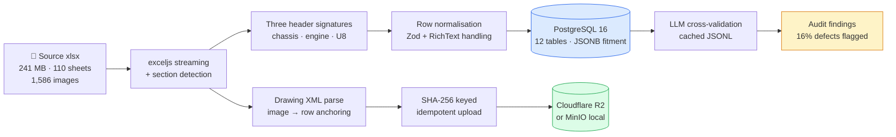
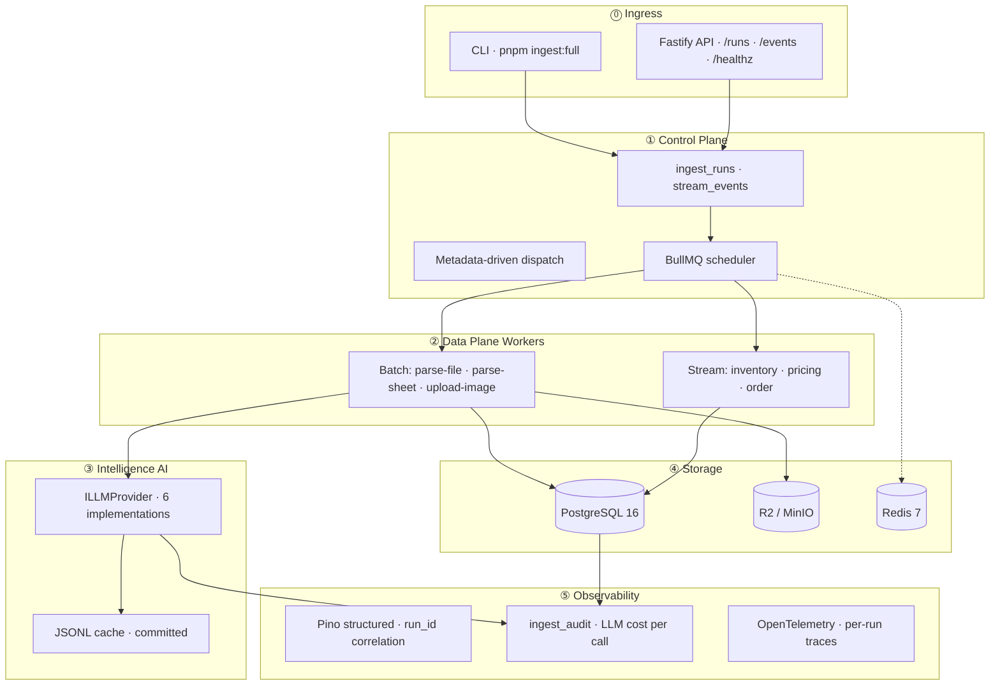
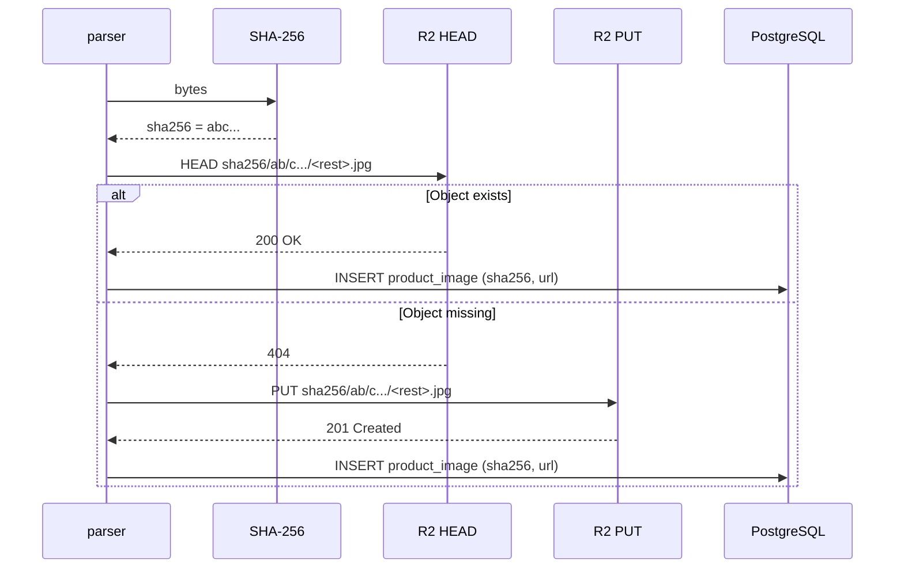
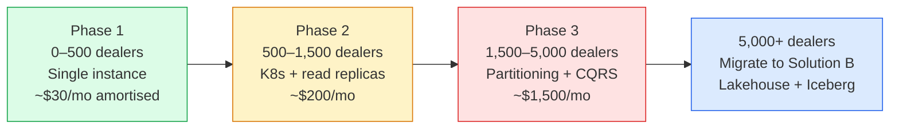

```mermaid
flowchart TB
    subgraph "Phase 1 — dev seeding (no marginal cost)"
        D1[LLM_PROVIDER=claude-code-handoff<br/>pnpm enrich --mode audit]
        D1 --> T[translation_tasks.jsonl]
        T --> H[Operator translates<br/>in Claude Code session<br/>under Max subscription]
        H --> R1[translation_results.jsonl]
        R1 --> C[llm-cache.jsonl committed to git]
    end

    subgraph "Phase 2 — reviewer execution (zero cost)"
        D2[LLM_PROVIDER=cached pnpm enrich]
        D2 --> CH[Cache hit on every row]
        CH --> AU[ingest_audit · cache_hit=true]
    end

    subgraph "Phase 3 — production runtime"
        D3[LLM_PROVIDER=ollama OR anthropic-batch]
        D3 --> SH[~99% cache hit at steady state<br/>same CN strings across dealers]
        SH --> CO[Real upstream: ~500 calls/month<br/>at 1,000 dealers]
    end

    style C fill:#dcfce7,stroke:#16a34a
    style CH fill:#dcfce7,stroke:#16a34a
    style SH fill:#dbeafe,stroke:#2563eb
```

# Solution A — JD-Native (the recommended path)

> *TypeScript · Node 22 · PostgreSQL 16 · Redis 7 · BullMQ · Fastify · Drizzle · Cloudflare R2*
>
> This is the answer for InventoryFlow today. It matches the JD's stack 1:1, ships in days, costs ~$30/dealer/month at amortised scale, and is the right answer until one of six quantified triggers fires.

---

## 25-second pitch

A single Node service ingests the messy 241 MB OEM xlsx, normalises 110 sheets across three header signatures into a 12-table PostgreSQL schema, uploads 1,586 embedded schematic images to Cloudflare R2 with SHA-256 content addressing (resulting in 382 deduplicated objects), and routes optional LLM cross-validation through a six-provider abstraction with a committed JSONL cache so reviewers pay nothing. End-to-end wall-time on M2 Mac: ~60 seconds. Fitment-query latency: p50 = 0.60 ms, p99 = 1.02 ms.

---

## Pipeline at a glance



Each stage is observable, replayable, and idempotent. The system is fundamentally a **streaming xlsx parser → typed normaliser → write-once storage** with LLM cross-validation as an out-of-band quality lane.

---

## The 5-plane architecture



The plane separation is deliberate. **Ingress** is request reception only — no business logic. **Control** is run-state and scheduling. **Data plane** is the only place rows get written. **Intelligence** is isolated behind the provider interface, swappable without touching the data plane. **Storage** is single-writer, multi-reader. **Observability** wraps everything via dependency injection so logs and traces flow from the same `run_id` everywhere.

This is the same pattern I built at Ashley Furniture's Fabric refactor — registry, generic load runner, lineage builder, DQ engine, audit, scheduler kept separate from the data layers. The InventoryFlow version is the early-stage shape of it.

---

## Tech stack rationale

Every choice below was made against a specific alternative. The point of the table is not "we use these libraries" but "we considered the alternative and these were better for *this* problem".

| Component | Chosen | Considered | Why this won |
|---|---|---|---|
| **Language** | TypeScript | Python | JD match; type safety on JSONB fitment is the hot path |
| **Runtime** | Node 22 | Bun, Deno | Drizzle/BullMQ/Pino ecosystem maturity; Bun's npm compat still has gaps in BullMQ |
| **HTTP** | Fastify | Express, Hono | Native Pino integration; schema validation built in; ~3× Express throughput |
| **ORM** | Drizzle | Prisma | Concrete JSONB type inference (Prisma collapses to `unknown`); no generation step |
| **xlsx parser** | exceljs (streaming) | xlsx (SheetJS), node-xlsx | Only library combining streaming + drawing XML access for image anchors |
| **Validation** | Zod | io-ts, Joi, Yup | Single source of truth for runtime AND compile-time types |
| **Queue** | BullMQ + Redis | RabbitMQ, NATS, Kafka | Active maintenance; dead-letter native; rate-limiting and OTel hooks |
| **Logging** | Pino | Winston, Bunyan | Fastest structured logger in Node; correlation by `run_id` is trivial |
| **DB** | PostgreSQL 16 | MySQL, MongoDB | JSONB + `GIN jsonb_path_ops` is the killer feature for fitment; `LISTEN/NOTIFY` for streaming |
| **Migrations** | Drizzle Kit | Knex, raw SQL | Type-aware; survives the `NULLS NOT DISTINCT` quirk (more below) |
| **Image storage** | R2 / MinIO | S3, GCS | R2 has identical S3 SDK + no egress fees; MinIO for local reviewer parity |
| **Cache (LLM)** | JSONL on disk | SQLite, Redis | Zero native deps (no Xcode); human-readable; committed to git for reviewer |

A separate ADR exists for each choice in the impl repo's [`docs/decisions/`](https://github.com/ankinguyen-engineer-2002/inventoryflow-catalog-ingest/tree/main/docs/decisions). The point of the ADRs is not "this was a hard decision" but "if you disagree, this is the surface where we negotiate".

---

## JSONB fitment design — the test specification's hot path

### Schema shape

Each row in `products` carries a `fitment JSONB NOT NULL` column shaped as an array of objects:

```json
[
  {
    "year": 2016,
    "make": "Kayo",
    "model": "Predator 125",
    "model_code": "AT125-B",
    "variant": null,
    "category": "SPORT_ATV",
    "section": "Front Brake Assembly",
    "callout_no": "1-1",
    "confidence": "high"
  }
]
```

### Index

```sql
CREATE INDEX products_fitment_path_ops_idx
ON products USING GIN (fitment jsonb_path_ops);
```

`jsonb_path_ops` was chosen over default `jsonb_ops` because:
- Smaller index (~30% smaller on this dataset)
- Faster for `@>` containment queries (the dominant pattern)
- Trade-off: doesn't support key existence queries (`?` operator), which we don't use

### The dominant query

```sql
SELECT part_number, name_en, name_cn
FROM products
WHERE fitment @> '[{"make":"Kayo","model_code":"AY70-2"}]'
LIMIT 10;
```

**Measured on 3,938 products, 500 samples on M2 Mac:**

| p50 | p95 | p99 | max |
|:---:|:---:|:---:|:---:|
| **0.60 ms** | **0.87 ms** | **1.02 ms** | **1.32 ms** |

### Why not normalised?

The naive alternative is a `product_fitments` join table:
```
products (id, part_number, ...) → product_fitments (product_id, year, make, model, ...)
```

Arguments for normalisation:
- ✅ Referential integrity to a `vehicle_models` master
- ✅ Faster aggregate queries ("how many parts fit Kayo Predator?")

Arguments against (which won here):
- ❌ Test specification explicitly asks for a JSON column on `products`
- ❌ Every catalog API call requires a join — single-table is one less network hop
- ❌ Marketplaces consume the JSON shape directly; the join would re-materialise on every export
- ❌ `vehicle_models` can be materialised from `fitment` in one SQL pass (`SELECT DISTINCT make, model_code, year FROM products, jsonb_to_recordset(fitment)`)
- ❌ Updates are batch (re-ingest the catalog) not individual; the integrity concern is less load-bearing

The denormalised JSONB is the correct shape for this access pattern. The materialised `vehicle_models` table (35 rows from this dataset) is built post-ingest and serves drop-down population.

---

## Image handling — SHA-256 idempotency and R2 upload

### The problem

1,586 schematic images embedded in the xlsx. Many are *literally the same fastener diagram repeated across sections*. Naive ingestion uploads every one to R2 and pays for 1,586 PUT operations + storage. Re-running ingestion uploads them all again.

### The solution



### Object key shape

```
sha256/<first-2-chars>/<next-2-chars>/<rest-of-hash>.<ext>
```

Prefix sharding (the first 4 hex chars become directory levels) is for R2's request-distribution behaviour at scale — same trick S3 used to recommend before automatic partitioning. Effectively for free on R2.

### Measured deduplication

| | Source | After dedup | Ratio |
|---|---|---|---|
| Images embedded in xlsx | 1,586 | — | — |
| Distinct SHA-256 hashes | 382 | 382 | **24% retained / 76% dedup** |
| R2 PUT operations | — | 382 | — |
| R2 monthly storage @ 50 KB avg | — | ~19 MB | $0.000285 |

This is a single OEM. Cross-dealer dedup (same fastener image used by Kayo and a hypothetical second dealer) would compress further. Solution A scopes images per dealer prefix by default — `dealer/<id>/sha256/...` — with a `--global-dedupe` flag that drops the dealer prefix for shared object pools (planned for dealer #2).

### Image-to-row anchoring

`exceljs` does *not* expose image anchors via its public API. The xlsx file is a zip; image anchors live in `xl/drawings/drawing<N>.xml`. The parser opens the zip directly and reads the drawing XML using random-access file reads (streaming leaks file handles when there are 1,500+ entries in a zip — learned the hard way).

Anchored images bind to a specific row → product. Un-anchored images (some are decorative section headers) get the section-title fallback so they're not orphaned but are clearly less precise.

---

## LLM integration

The brief encourages AI tooling. This is one of the most over-spent line items I've seen in early-stage data startups, so the implementation is deliberately conservative.

### The abstraction

```typescript
interface ILLMProvider {
  translate(input: TranslateInput): Promise<TranslateOutput | null>
  classifyCategory(input: CategoryInput): Promise<CategoryOutput | null>
  // ...
}
```

Six concrete implementations:

| Provider | Cost | Use case |
|---|---|---|
| `mock` | $0 | Unit tests; deterministic safety fallback |
| `cached` | $0 on hit | **Default**: decorator wrapping any upstream |
| `claude-code-handoff` | $0 | Dev cache seeding via Claude Max subscription |
| `ollama` | $0 (self-hosted) | Production: Qwen 2.5 or Llama on local GPU |
| `anthropic-batch` | ~$0.0005/call | Cloud production via Anthropic batch API |
| `gemini` | (intentionally off) | Excluded: TOS allows training on customer data |

Switch by env var: `LLM_PROVIDER=cached pnpm enrich`. Business logic stays unchanged. This is dependency injection at the provider level — the lever that makes the cost story possible.

### The cache

`shared/llm-cache.jsonl` — one JSON object per line, keyed by `SHA-256(field + sorted_inputs_json)`. Cache hit returns synchronously; miss calls upstream, persists result, returns. **Null results are never cached** (critical for handoff workflows where null means "task pending, human translating").

JSONL was chosen over SQLite because:
- `better-sqlite3` requires Xcode tools — broken on fresh M-series Macs and Linux CI containers
- Node's `node:sqlite` requires `--experimental-sqlite` flag, which breaks Vite bundler
- Linear scan of JSONL is <1 ms for realistic cache sizes (<10k entries)
- Human-readable for debugging
- Trivially git-committable so the reviewer pays nothing

The revisit trigger: cache > 100k entries (move to SQLite or Redis).

### Three-phase LLM lifecycle



The Claude-handoff phase deserves a separate note: the developer is already inside Claude Code reading the codebase. The handoff provider exports translation tasks as JSONL, the developer translates them in the same Claude conversation (no API key required), the results JSONL is re-imported, the cache is populated. **This recognises that the human is already in the loop and stops paying for what's already free.**

### Cost economics at 1,000 dealers/week steady state

| Item | Value |
|---|---|
| Distinct Chinese strings globally | ~50,000 |
| Cache hit rate at steady state | ~99% |
| Real upstream calls per month | ~500 |
| Average call size | 80 input + 20 output tokens |
| Cost per call (Anthropic Sonnet) | ~$0.0005 |
| **Monthly LLM bill** | **~$0.25** (with retries: $1–$5) |

To put that in context: the most over-spent line item at most early-stage data companies I've talked to is in the $300–$3,000/month range for the same workload. The cache + provider abstraction + global deduplication is the architectural lever that flips the cost story by ~3 orders of magnitude.

### Audit findings on the reference dataset

Audit mode samples products, asks the LLM to translate the Chinese name independently, and compares to the dealer's supplied English. Results on **68 sampled products**:

| Outcome | Count | Meaning |
|---|---|---|
| **Agree** | 25 | LLM translation matches dealer EN |
| **Partial** | 32 | EN is correct; LLM adds technical detail (e.g., dimensions) |
| **Disagree** | 11 | LLM and dealer differ in a way that *suggests dealer-supplied defect* |

Of the 11 disagreements, examples confirmed as real dealer defects include:
- "busher" → bushing (typographical error)
- "support clamping piece (left and right)" → bracket (terminology, not a typo, but inconsistent with rest of catalog)
- Several Chinese-to-English category mismatches (e.g., "steering" tagged as "engine")

**The LLM is a defect detector, not a translator of record.** The system writes the dealer's English to `name_en` and the LLM's English to `name_en_llm` with a `data_quality` score on the row. Marketplace listings can choose to ship `name_en`, escalate disagreements to a human reviewer, or A/B test.

### The five-layer accuracy framework

1. **Confidence scoring** per LLM call (high / medium / low based on output structure)
2. **Validation rules** (ASCII-clean, length sanity, no prompt-leak markers)
3. **Cross-row consistency** (same CN string → same EN across products; flag deviations)
4. **Ensemble agreement** (configurable: run two providers, flag disagreements)
5. **Production feedback loop** (marketplace listing errors invalidate cache entries, trigger re-translation)

The first three are implemented in Solution A. Layers 4 and 5 are designed and deferred — layer 4 fires when LLM cost share crosses 30% of monthly cloud bill (one of the migration triggers); layer 5 fires when marketplace integration is built.

---

## Output verification — *how do you know the data is right?*

The brief doesn't ask this question. The senior reader asks it.

A full discussion is in [`07-output-verification.md`](./07-output-verification.md). Summary of what's in Solution A today:

| Layer | What it catches | Implementation |
|---|---|---|
| **Zod runtime schema** | Wrong types, missing fields, format violations | `src/parse/normalize.ts` |
| **Database constraints** | Duplicate part_number, NULL on required columns | `migrations/0001_*.sql` |
| **Section-detector tests** | Mis-parsed sections, header drift across OEMs | 9 unit tests |
| **Fitment-resolver tests** | Year encoding errors (7 patterns in real data) | 9 unit tests |
| **LLM audit mode** | Translation defects, category mismatches | `ingest_audit` table |
| **Idempotency check** | Re-ingest produces same row count | `pnpm test:idempotency` |
| **Benchmark gate** | Fitment query > 50ms = regression | `pnpm bench` + CI |

The recurring theme: **fail loud, not silently**. If the OEM changes a header tomorrow, the section detector returns no matches and the run fails with a specific error, not a partial ingest with 30% silent data loss. I have seen the silent variant in production. It is not recoverable without manual data reconciliation. I will not ship it again.

---

## Scale roadmap — what changes as the dealer count grows



### Phase 1 (0–500 dealers) — what shipped

Single-instance Postgres, Redis, BullMQ worker, R2. Docker-compose for local; one Fly.io or Railway deployment for production. Manageable by a TypeScript engineer with no DBA support.

### Phase 2 (500–1,500 dealers, ~1 week effort)

| Change | Why | Effort |
|---|---|---|
| PgBouncer transaction-mode pool | 3× connection capacity without horizontal scale | 2 h |
| Kubernetes workers (10 replicas) | Independent scaling of parse/upload/enrich | 1 d |
| Redis Cluster (3 nodes) | Queue throughput; cache distribution | 1 d |
| Read replica + read/write split | Catalog API reads off replica; ingestion writes primary | 1 d |
| R2 bucket sharding `hash(dealer_id) % 16` | Per-bucket request limit; tenant isolation | 4 h |
| Materialised view for hot fitment queries | Sub-millisecond on top-1000 vehicle queries | 4 h |
| LLM cache → shared Redis | Global cache hit rate; cross-instance dedup | 2 h |

### Phase 3 (1,500–5,000 dealers, ~3–4 weeks effort)

| Change | Why | Effort |
|---|---|---|
| Hash-partition `products` by dealer_id (16 partitions) | OLTP write fan-out at this scale | 3 d |
| Per-tenant Redis namespace | Isolation and quota | 2 d |
| CQRS write/read separation | Stop OLAP queries blocking catalog API | 1 wk |
| Global canonical-translations table | LLM cost containment | 2 d |
| MDCP runtime dispatcher | Dealer-specific ingestion patterns | 3 d |
| Per-tenant SLO tracking + tracing | Multi-dealer support and debugging | 2 d |
| Logical replication standby + auto-failover | RTO < 1 hour | 3 d |
| Cloudflare CDN for image egress | Reduce R2 GET costs | 1 d |

### Beyond Phase 3 — migrate to Solution B

Six explicit triggers ([`00-tldr.md`](./00-tldr.md) has the table). The migration is *not* a rewrite — Solution B replaces only the ingestion plane. The Postgres serving database, the Fastify catalog API, and the marketplace integration remain unchanged. The TS team continues shipping features; the DE platform is built in parallel.

---

## Ten engineering decisions worth defending

A representative slice of choices that are non-obvious from the code. Each has an ADR in the impl repo's [`docs/decisions/`](https://github.com/ankinguyen-engineer-2002/inventoryflow-catalog-ingest/tree/main/docs/decisions).

1. **`NULLS NOT DISTINCT` on `products` unique index.** Default Postgres treats NULL as distinct, which breaks idempotency when `source_dealer_id` is NULL during the single-dealer demo. Migration 0001 rebuilds the index. Without this, replay produces duplicates silently — exactly the failure mode this submission promises not to ship.

2. **JSONL cache over SQLite.** Discussed above. Zero native deps wins for this scale.

3. **Drizzle over Prisma.** Concrete JSONB type inference is the hot path; Prisma's `unknown` JSON type forces runtime casts that defeat the point.

4. **Metadata-driven control plane seeded, dispatcher deferred.** Three registry tables present; runtime dispatch starts at dealer #2. Captures the design intent without paying the complexity cost today. This is the same pattern from my Ashley Furniture work — the registry insert is the onboarding workflow at scale.

5. **Six LLM providers with cache decorator default.** The cache is *always* on. Removing the decorator is harder than adding new providers. This makes the zero-cost reviewer story safe by default.

6. **Claude-code-handoff for dev cache seeding.** Recognises the developer is already inside Claude Code. Free under Max subscription. The cache produced is committed to git.

7. **BullMQ over direct sync workers.** Streaming a thousand dealers simultaneously through the request handler would exhaust the Node process memory. Queues buffer the burst; concurrency-per-queue lets parse / upload / enrich scale independently.

8. **Transactional outbox for streaming.** `stream_outbox` is written in the same transaction as `stream_events`. The publisher (drains to Redpanda / Kafka) is stubbed — the design preserves the migration path without paying the bus dependency today.

9. **Section detection via header-signature regex, not row indices.** Sheets have 10–20 independent sections per file; row indices vary. Signature matching is explicit about which signatures are recognised; an unknown signature fails the run rather than silently corrupting data.

10. **Rich-text cell coercion for Chinese.** `exceljs` returns formatted cells as `{ richText: [...] }`; naive `String(v)` produces `[object Object]`. The first implementation crashed on row 200 of 12k with mysterious corruption. Dedicated `cellToString` utility walks the structure. Lesson: never ship a parser without explicitly handling rich-text on the languages you're targeting.

---

## Gotchas surfaced (the things you only learn by doing this)

1. **`exceljs` drawing anchors not in public API.** Open the zip directly and parse `xl/drawings/drawing<N>.xml`. Use random-access file reads — streaming leaks file handles at 1,500+ zip entries.

2. **BullMQ reserved characters.** Queue names with colons (`q:parse-file`) collide with internal key separators. Use camelCase.

3. **Redis `maxmemory-policy=allkeys-lru` silently drops BullMQ jobs.** Switch to `noeviction`. Add a comment to docker-compose explaining why so the next engineer doesn't "fix" it back.

4. **Polymorphic `No.` callouts.** Same product has integer, decimal, "1-1", "1-6L", or NULL formats. Dedup on `part_number`, never on callout. The test data fails silently if keyed wrong.

5. **`postgres.js` cannot infer `pg_notify` parameter type.** Use `sql.unsafe` with explicit `$1::text`. Provider-specific quirk; not present in `node-postgres`.

6. **Twelve "exception" sheets are not parts.** Spark plugs, carburetor jets, wheel specs — different shape. Separate `ingest:references` command with flexible JSONB `attributes` rather than forcing the parts schema.

7. **Dealer make inference from model code prefixes.** "Kayo" is not present in any cell; it's inferred from `AT125-B`-style codes. Inference failure defaults to NULL; queries need explicit `IS NULL` handling.

---

## Testing strategy

| Layer | Files | Tests | Why these |
|---|---|---|---|
| Parser correctness | section-detector, fitment-resolver, row-normalizer | 28 | The hot path of messy data; parser bugs are silent and expensive |
| Cache integrity | llm-cache | 3 | The cost story depends on cache correctness |
| Env validation | env | 1 | Misconfigured prod is the most common outage cause |
| **Total** | **5 files** | **32** | Runs in <400 ms |

What's deliberately not tested at the unit level:
- Database queries — covered by integration tests that hit a real PG in docker-compose
- BullMQ workers — covered by integration tests
- LLM provider implementations — `mock` provider is itself the test fixture

The choice is to spend the test budget on the data correctness paths, not on mock-heavy unit tests of integration code.

---

## Where Solution A breaks — and what to read next

When any of the six migration triggers fires (see [`00-tldr.md`](./00-tldr.md)), Solution B is the path. The next document is [03-solution-B-de-standard.md](./03-solution-B-de-standard.md) — the industry-standard data-engineering architecture, scoped to *replace only the ingestion plane*, with serving database and APIs unchanged.

---

**Next:** [03-solution-B-de-standard.md](./03-solution-B-de-standard.md)
