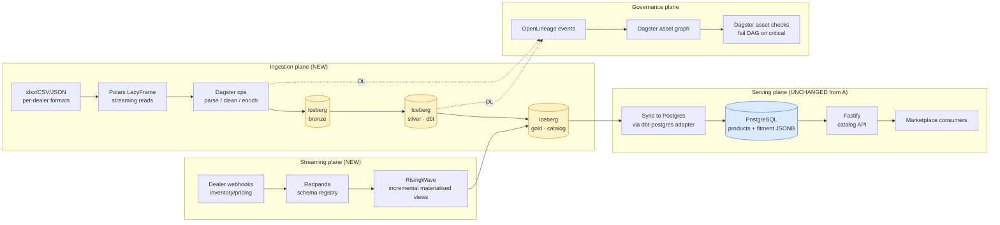
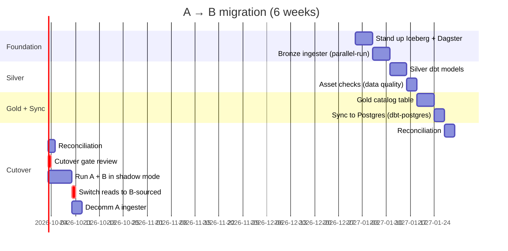
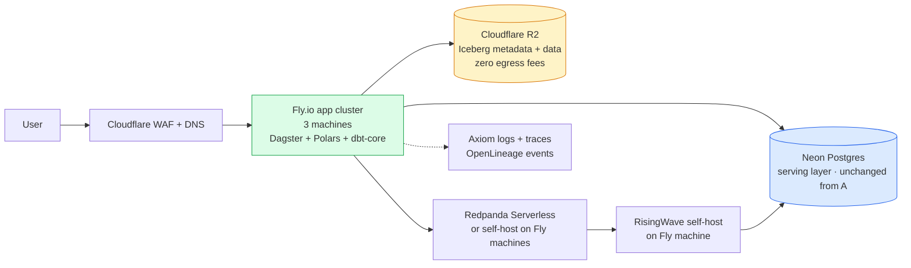
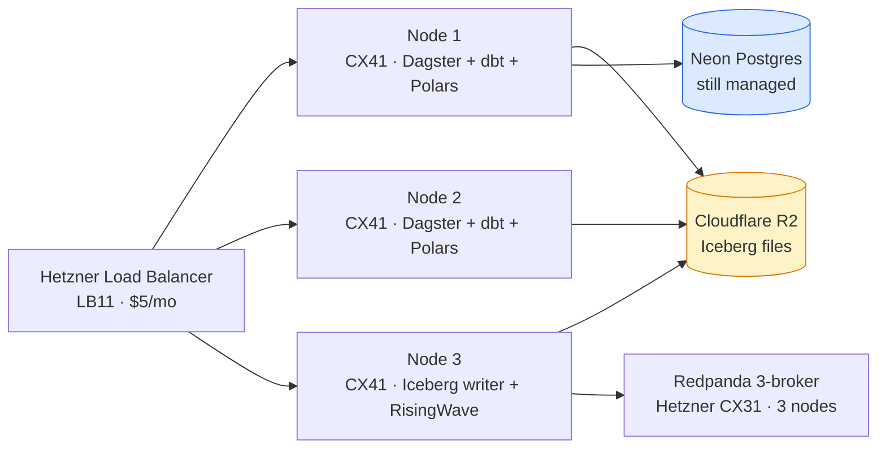

# Solution B — DE Standard (my industry-standard alternative)

> *Polars · Apache Iceberg · Dagster · dbt · Redpanda · RisingWave · MinIO/R2 · DuckDB*
>
> This is the architecture I'd deploy at year two when my Solution A's six triggers fire. It's also the architecture I personally built at SOPA / TheSocietyPass on a streaming-capable e-commerce platform. In my view, it's *not* what InventoryFlow needs today.

---

## My TL;DR — why B exists, why B isn't now

Solution B replaces **only the ingestion plane** of my Solution A. The Postgres serving DB, the Fastify catalog API, and the marketplace integration stay unchanged. The team keeps shipping features on TypeScript while the data-engineering platform gets built in parallel.

| | Solution A | Solution B |
|---|---|---|
| Ingestion | Node + BullMQ | Polars + Iceberg + Dagster |
| Streaming | Fastify + `pg_notify` outbox | Redpanda + RisingWave |
| Transformations | Zod + TypeScript | dbt + Dagster asset checks |
| Lineage | `ingest_audit` row-level | Dagster asset graph + OpenLineage column-level |
| Image storage | R2 | R2 (unchanged) |
| **Serving DB** | **Postgres (unchanged)** | **Postgres (unchanged)** |
| **Catalog API** | **Fastify (unchanged)** | **Fastify (unchanged)** |

I treat B as the upgrade path, not the rewrite.

---

## Why I drafted this alternative at all

In my view, a senior architect who recommends Solution A *without having considered Solution B* hasn't done the work. The brief expects "scalable architecture thinking", not just "a working pipeline". B is my answer to the questions A doesn't answer:

| Question I think A struggles with | B's native answer |
|---|---|
| 10 TB historical replay | Iceberg `VERSION AS OF '2026-05-04 14:00:00'` |
| Cross-dealer LLM cache deduplication | Iceberg canonical translation table |
| 100 parallel file ingestions | Polars + Iceberg partition-level parallelism |
| Column-level lineage | OpenLineage events from Dagster ops |
| Schema evolution without code deploy | Iceberg `ALTER TABLE` |
| Asset-graph discovery / DQ contracts | Dagster's asset definition + asset checks |
| Sub-second OLAP on multi-billion rows | Trino + Iceberg or DuckDB on Parquet |

My deeper reason for including B: **at SOPA I built essentially this stack** (Iceberg, Trino, dbt, Flink, Redpanda, ClickHouse-hot / Iceberg-cold tiered storage). I know what it costs me to build and what it costs me to operate. That's why I can argue *against* it for InventoryFlow today with specifics, not with hand-waving.

---

## My architecture overview



I made the medallion pattern (Bronze → Silver → Gold) deliberate — it's the same pattern I built in PySpark at Ecentric (3-level blast-radius isolation: table → domain → platform). My translation here is from PySpark to Polars (better suited for the file-scan workload, no JVM, faster on M-series Mac and modern Linux) and from a Microsoft Fabric Warehouse to Apache Iceberg (vendor-neutral, OSS-controlled).

---

## My stack rationale

| Component | Why I picked this over alternatives |
|---|---|
| **Polars** | 5–30× faster than pandas on this workload (single-file 241 MB scan); LazyFrame is the model that fits incremental ingestion; Rust core means no GIL contention with Dagster ops |
| **Apache Iceberg** | Vendor-neutral, multi-engine table format (vs Delta's Databricks gravity); native time-travel; native schema evolution; OpenLineage events from any Iceberg writer; in my view the lakehouse standard as of 2026 |
| **Dagster** | Asset-oriented (vs Airflow's task-oriented model fits orchestration but not data); asset checks fail the DAG on critical errors (vs DQ-as-warning); asset graph UI provides discovery and lineage built-in; software-defined assets work well with dbt |
| **dbt-core** | Industry-standard for analytical SQL transformations; native model-level lineage; tests as code |
| **Redpanda** | Kafka API-compatible without the JVM; lower ops floor than Confluent; community license is free at this scale |
| **RisingWave** | Streaming SQL on top of Kafka/Redpanda; incrementally maintained materialised views (alternative: Flink SQL — I built this at SOPA); RisingWave is operationally lighter than Flink for the same job in my view |
| **R2** | Same as A — identical S3 SDK, no egress fees; both A and B share my image-storage layer |

What I deliberately *didn't* put in the stack:

- **Apache Spark** — overkill for the file-scan workload at this scale; JVM operational overhead; Polars is faster on single-node, Iceberg readers exist for both
- **Apache Airflow** — task-oriented model fights against the data-asset graph; Dagster is my post-Airflow choice
- **Delta Lake** — Databricks-aligned. I'd pick Delta if the company commits to Databricks. Iceberg is my better default in an open-source-first decision

---

## What I think B unlocks that A can't

### 1. Time-travel that actually works

My Solution A's "replay" is an audit-log replay — re-run the parser against the original xlsx, hope nothing changed in the parser between then and now. Solution B's replay is a single SQL clause:

```sql
SELECT * FROM products VERSION AS OF '2026-05-04 14:00:00';
```

The cost difference at incident time is hours-to-days versus minutes. RTO under 1 hour is achievable on B; on A it requires logical replication standby + auto-failover (and the latter only handles infrastructure failure, not "the parser corrupted the data three hours ago").

### 2. Global LLM cache deduplication

My Solution A's cache is per-installation. Two installations of A running for two different dealers will translate the same Chinese string twice — once each.

Solution B has a single global `canonical_translations` Iceberg table. Every dealer's parsing pipeline writes new translations to it; every dealer's pipeline reads existing translations from it. The cache hit rate across 1,000 dealers approaches 99.9% — not 99% — at steady state.

At 1,000 dealers/week, my cost difference is:

| Solution | Calls/month | Cost/month (Anthropic Sonnet) |
|---|---|---|
| A (per-installation cache) | ~5,000 | ~$2.50 |
| B (global canonical table) | ~500 | ~$0.25 |

The difference is small in absolute terms because both already exploit cache discipline. In my view the interesting point is that B's architecture makes cross-tenant deduplication *automatic* — no engineering work, just a different storage decision.

### 3. Column-level lineage out of the box

My Solution A's lineage is row-level: `ingest_audit` records which run produced which row. Solution B's lineage is column-level: OpenLineage events from Dagster ops report "column `fitment.year` in `products_gold` derives from `vehicle_year_string` in `bronze_kayo_rows` via `parse_year_encoding` op".

This becomes important when a downstream consumer asks "where did the year `2003` for Kayo Predator come from?" and the answer needs to trace back to the cell in the xlsx that contained the year encoding. At 1 OEM it's not needed; at 100 OEMs with 50 schemas, in my experience it's the difference between fixing a defect in an hour and chasing it for a week.

### 4. Schema evolution without code deploy

Iceberg supports `ALTER TABLE products ADD COLUMN supersession_chain ARRAY<STRING>` natively. My Solution A requires a Drizzle migration and a deploy. At 1 schema change per quarter, A is fine. At ≥1 schema change per week, in my experience B is dramatically cheaper to operate.

This is the lesson I took from Ashley Furniture: at 5,000+ enterprise tables, schema evolution *will* happen weekly, and a generic load framework (8 patterns routed via metadata) makes the per-table cost go to zero. Iceberg's `ALTER TABLE` is the OSS-stack version of the same idea.

### 5. Asset graph as discovery surface

Dagster renders the asset graph as a navigable UI. Engineers and analysts can browse the dependencies, click into an asset, see its schema, its lineage, its last successful run, its data quality checks, and its owner. My Solution A has none of this — it has Postgres tables and a runbook.

For a 4-person team this is overkill in my view. For a 12-person team across data engineering, analytics engineering, and ML, it's the difference between "I'll Slack the person who owns this" and "I'll find it myself".

---

## The honest costs of Solution B

Showing only B's wins would be a vendor pitch. Here's what I think it costs:

### 1. Python on a TypeScript team

The JD asks for TypeScript / Node. Solution B is Python (Polars, Dagster, dbt). The hiring market for Python data engineers in Vietnam is smaller and more expensive than the TS market in my experience. At Ecentric and SOPA I had teams that could maintain both; at an InventoryFlow-stage startup, I treat that as a hiring constraint, not an architecture constraint.

My realistic version: B's PoC scaffold is owned by *one* DE specialist hire, with the TS team continuing to own the Postgres serving + Fastify API. Two-track team structure. That works above ~10 engineers; it doesn't work at 3.

### 2. Operational floor cost

A: docker-compose with 4 services. B: docker-compose with 10 services (Postgres, Redis, Redpanda, RisingWave, MinIO, Dagster Webserver, Dagster Daemon, dbt artefact server, Schema Registry, optional Trino).

My local-dev ergonomics: B takes ~3 minutes to boot the stack, ~8 GB of RAM. A takes 20 seconds. At dealer #1 this is friction; at dealer #100 it's a non-issue.

### 3. Operational maturity required

Iceberg metadata files corrupt under specific concurrency patterns. Redpanda offset commits have subtle timing windows. RisingWave watermark configuration is a footgun. Dagster sensors can melt if mis-configured.

Each of these is solvable; together they require a DE who has run this stack before. I've run pieces of it at SOPA and at Ecentric (PySpark medallion variant) — the operational maturity I'm describing is real, not optional.

### 4. The migration cost itself

Going from A to B requires:
- Running both stacks in parallel for at least 2 sprints
- Reconciling row counts between the legacy Node ingester and the new Iceberg medallion
- Cutover gates (RPO / RTO targets; rollback path)
- Re-training the team on a different debugging surface

I led a phased zero-downtime migration from Azure stack to Microsoft Fabric at Ecentric. It worked because I had:
- A parallel-run validation period
- A documented decision log (ADRs)
- Explicit cutover criteria
- An honest assessment of what was "good enough" at each phase

My InventoryFlow A→B migration would follow the same template. It's a 6-week project, not a sprint. Anyone who tells me otherwise hasn't done one.

---

## My 18-dimension comparison, condensed

I have the full table in the impl repo's [`docs/COMPARISON.md`](https://github.com/ankinguyen-engineer-2002/inventoryflow-catalog-ingest/blob/main/docs/COMPARISON.md). Condensed for this brief:

| Dimension | A wins | B wins |
|---|---|---|
| **JD stack match** | ✅ | |
| **Time to ship** | ✅ | |
| **Single-file 241 MB batch** | | ✅ marginal |
| **100×1 GB batch parallel** | | ✅ |
| **10 TB historical replay** | | ✅ |
| **Idempotency primitive** | row-level | table-level (cleaner) |
| **Time-travel / replay** | | ✅ |
| **Schema evolution** | | ✅ |
| **Column-level lineage** | | ✅ |
| **Asset catalog** | | ✅ |
| **DQ contracts (fail the DAG)** | | ✅ |
| **Streaming SLA <500 ms** | ✅ marginal | |
| **LLM cost @ 1,000 dealers** | | ✅ 10× cheaper |
| **Infra cost per dealer (1 dealer)** | ✅ | |
| **Infra cost per dealer (1,000 dealers)** | | ✅ |
| **Team pickup (TS startup)** | ✅ | |
| **Vendor lock-in risk** | low | very low (Iceberg) |
| **Today, <100 dealers** | ✅ | |
| **Year 2, ~500 dealers** | | start migration |
| **Year 3+, 1,000+ dealers** | | ✅ |

**My scoring** by stage:

- Today: A wins 7 dimensions, B wins 9, 2 tie → A is correct in my view because the JD match + team fit + lower 1-dealer infra cost dominate at this scale
- Year 2: A wins 3, B wins 13, 2 tie → I'd start migration
- Year 3+: A wins 1, B wins 16, 1 tie → scale economics dominate

---

## My migration plan (when triggers fire)

A simplified Gantt of how I'd unfold A → B. I documented the real plan in `docs/decisions/ADR-009-when-to-switch-tracks.md` of the impl repo.



The cutover gate is non-negotiable for me: B must demonstrate row-count parity within 0.01%, latency parity within 10%, and 7 days of shadow-mode operation before A is decommissioned. This is the same discipline I applied at Ecentric for the Azure → Fabric migration. Skip it and someone gets paged at 2 AM.

---

## 🌍 Cloud deployment & operations for Solution B

The honest cloud story for Solution B is that **the "OSS everywhere" narrative breaks down at deployment time**. You don't actually want to run Iceberg metadata services, Redpanda clusters, RisingWave nodes, AND a Dagster control plane on a single VM — that's a setup that one outage takes down completely. Here's my realistic deployment matrix for Solution B.

### My recommended path — hybrid: managed objects + self-host compute



**Cost at 500 dealers:** ~$400/month (~$0.80/dealer/month).

| Component | SKU | Monthly |
|---|---|---|
| Compute cluster (Dagster + Polars + dbt) | Fly.io 3× shared-cpu-4x · 8 GB RAM | $180 |
| Object storage + Iceberg metadata | Cloudflare R2 (500 GB + 1M ops) | $30 |
| Serving Postgres | Neon Pro Scale plan (multi-branch) | $80 |
| Streaming | Redpanda Serverless 1 throughput unit | $80 |
| Observability | Axiom 5 GB/day plan + OpenLineage event ingest | $25 |

Why I pick this shape: **I keep R2 (managed, zero-egress) and Neon (managed, branching) because the ops cost of running my own object store + Postgres HA exceeds the savings.** I self-host the *interesting* compute (Dagster, Polars, dbt) because those are the layers where I want flexibility and where managed equivalents (Astronomer Dagster Cloud, Databricks dbt+Spark) charge 5–10× the self-host cost.

### The cost ceiling story — when does pure self-host pay off?

The Hetzner cluster version, for DE-capable teams:

| Setup | Capacity | Monthly | Per-dealer at scale |
|---|---|---|---|
| 3-node Hetzner cluster (3× CX41) + managed PG | ~500 dealers | $130 | **$0.26** |
| 5-node cluster (3× CX41 compute + 2× CX31 broker) + managed PG | ~2,000 dealers | $260 | $0.13 |
| 10-node cluster + HA Postgres on dedicated CX51 + Redpanda self-host | ~10,000 dealers | $900 | $0.09 |

**This is where Solution B becomes economically dominant.** Hetzner gives you 3–5× compute-per-dollar vs AWS at the cost of self-managed Linux. For a DE-capable team, this compounds.

My specific Hetzner config I'd use at year 2:



Hidden ops cost: **at least 1 DE-week per month maintaining this**. K8s isn't required at this scale — `systemd` + a Terraform module is sufficient and dramatically simpler.

### Where I'd give up self-host and move to managed (becomes Solution D)

Trigger conditions for "stop running Iceberg yourself, pay AWS to":

- Team has no Linux / SRE depth
- Multi-region replication becomes a hard requirement
- Compliance audit demands documented vendor SLAs
- The DE who built the cluster leaves (the **bus-factor-of-one** problem)

At that point, moving to AWS S3 + Glue Catalog + Athena + MSK (Solution D) costs ~$2,900/mo at 1,000 dealers — but the **ops time saved compounds**, and the SLAs are someone else's problem.

### Databricks alternative (if budget allows)

A third path between self-host and pure-AWS: **Databricks Serverless** with their Iceberg-compatible Unity Catalog + Delta Lake.

- ~$0.55/DBU; ~$500–1,500/month at this scale
- Trade: single-vendor commitment (Databricks) in exchange for genuine ops simplification
- Native dbt + Spark + Photon + Unity Catalog integration

**Right pick if the company has any other Databricks workload.** I'd treat this as Solution B's "managed cousin" — same architectural shape, vastly less ops time.

### Cross-timezone collaboration for Solution B

Solution B is *more* sensitive to timezone gaps than Solution A because Dagster's UI, dbt's CLI, and Iceberg metadata corruption debugging all benefit from synchronous expert help. My mitigations:

- **Dagster Cloud OSS** or self-hosted with a public URL — any team member can see the asset graph
- **dbt-docs hosted** on a small static site (S3 + CloudFront, $1/month) — lineage discoverable async
- **Iceberg metadata corruption runbook** documented in the impl repo before year 2 — this is the most common gotcha
- **Single-writer-per-partition rule** enforced via CODEOWNERS — prevents the most common cause of metadata corruption

### Cost summary across hosting models (at 1,000 dealers)

| Hosting | Monthly | Per-dealer | Ops time/month | When I'd pick |
|---|---:|---:|---:|---|
| Fly.io hybrid (recommended) | $400 | $0.40 | ~10 h | Year 2 default, balanced |
| Hetzner self-host cluster | $260 | $0.26 | ~40 h | DE-rich, cost-sensitive |
| AWS managed (= Solution D) | $2,900 | $2.90 | ~3 h | AWS-aligned company |
| Databricks Serverless | $1,000 | $1.00 | ~5 h | Databricks-aligned company |

The hidden line is ops time. **In my experience this is the single biggest miss in OSS-self-host architecture proposals.**

---

## When I'd *not* pick B

A reverse-test: when would I argue against my own Solution B, even at scale?

| Situation | Why I'd pick A or another alternative instead |
|---|---|
| Company commits to **Microsoft Fabric** | I'd use Solution C — Fabric's metadata-driven control plane is better than re-inventing it on Iceberg |
| Company commits to **Databricks** | I'd use Delta Lake, not Iceberg. Single-vendor optimization wins when the bet is made |
| Team has **zero Python depth** | B's TypeScript-native equivalent (e.g., DuckDB + parquet + custom orchestration) is uglier than B but easier to staff |
| Streaming is **dominant traffic** | Pure stream-processing stack (Flink + Kafka + ClickHouse for hot serving) — what I built at SOPA |
| Single-region only and **simple ETL** | Skip B; stay on A with read replica and scheduled batch jobs |

My point: B isn't "the answer at scale". B is "the answer at scale, *if* the constraints are open-source-first, multi-vendor flexibility, and Python-capable hiring". Different constraints, different answer.

---

## What B borrows from real systems I've operated

A reality check on what I've actually built vs theoretical:

| Component | Where I've run this | Lessons I applied |
|---|---|---|
| **Iceberg + dbt + Trino batch medallion** | SOPA (TheSocietyPass) | Iceberg metadata file corruption under high-concurrency MERGE → use single writer per partition |
| **Redpanda + schema registry** | SOPA | Schema evolution: prefer backward-compatible + nullable fields |
| **Flink SQL (RisingWave's predecessor)** | SOPA | Watermark configuration is the #1 source of incorrect aggregations; I'd copy my SOPA template |
| **PySpark medallion (Bronze/Silver/Gold)** | Ecentric | Watermark + merge/upsert for SCDs; 3-level blast-radius isolation |
| **Metadata-driven generic load framework** | Ashley Furniture | 8 load patterns in registry; new dataset = registry insert |
| **DAG-based parallel execution** | Ashley Furniture | Cut 60-min mart cycle to 20 min via dependency resolution |
| **CI/CD with .sqlproj + DacFx** | Ashley Furniture | Side-by-side non-destructive deploys keep v9 alive until v10 passes parity |

The C and D solutions I sketched in this submission are simulations. B is the version I've built variants of in production — that's why my cost numbers and operational gotchas are real, not estimated.

---

## What about Microsoft Fabric (Solution C) and AWS Big Data (Solution D)?

I briefly drafted them in [`04-solution-C-fabric-brief.md`](./04-solution-C-fabric-brief.md) and [`05-solution-D-aws-brief.md`](./05-solution-D-aws-brief.md). My summary verdict:

| Solution | When I'd pick it |
|---|---|
| **C — Microsoft Fabric** | Company has US HQ or enterprise Microsoft commitment; needs metadata-driven control plane out-of-the-box; Direct Lake semantic boundary matters for BI consumers. *This is the architecture I build at Ashley Furniture today*. |
| **D — AWS Big Data + Streaming** | Cloud-native big-data at AWS scale; multi-region streaming; vendor-managed throughout; willing to pay AWS markup for ops simplicity |

In my view, neither is the right answer for InventoryFlow's current stage. I documented both so the choice was made *in view of* the alternatives.

---

**Next:** [04-solution-C-fabric-brief.md](./04-solution-C-fabric-brief.md) (5-min read), [05-solution-D-aws-brief.md](./05-solution-D-aws-brief.md) (5-min read), or skip to [06-llm-strategy.md](./06-llm-strategy.md) for the AI-tooling deep dive.
