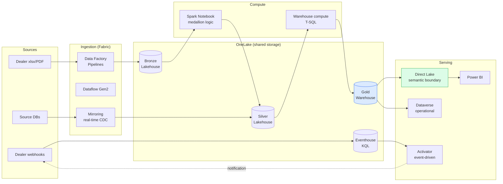

# Solution C — Microsoft Fabric (my executive brief)

> *OneLake · Lakehouse · Warehouse · Pipelines · Dataflow Gen2 · Spark Notebook · Eventhouse (KQL) · Direct Lake · Activator · Dataverse · Mirroring*
>
> This is the architecture I'd recommend when the company has US HQ Microsoft commitment or enterprise Fabric capacity. **It's also the architecture I build today at Ashley Furniture Industries** — so my recommendation here is grounded in production experience, not vendor brochures.

---

## My 60-second pitch

In my view, Microsoft Fabric collapses the lakehouse + warehouse + streaming + BI stack into a single SaaS plane with metadata-driven control out of the box. For a company aligned with Microsoft enterprise infrastructure, I think it's the *lowest-effort* path to a governed, observable, multi-tenant data platform. For InventoryFlow today, I'd say it's a poor fit — primarily because of the capacity commitment.

---

## My architecture sketch

OneLake is the unifier — every component (Lakehouse, Warehouse, Eventhouse) writes to the same physical storage layer via Delta Parquet. OneLake Shortcuts make cross-workspace zero-copy sharing trivial. In my opinion, that's the architectural property that makes Fabric genuinely different from "ADF + Synapse + Power BI stitched together".

---

## What I'd say Fabric does that B (open-source) doesn't

| Capability | Fabric native | OSS equivalent |
|---|---|---|
| **Direct Lake semantic boundary** | First-class, official | None — DuckDB/Trino on Iceberg requires manual sync to BI tool |
| **Mirroring (DB → Lakehouse CDC)** | Click-to-configure, sub-second | Debezium + Iceberg writer (custom build) |
| **Eventhouse (KQL real-time)** | Single-button provision | Materialise (paid) or RisingWave + ClickHouse self-host |
| **Activator (event-condition-action)** | Visual UI on top of Eventhouse | Custom Flink job + alerting glue |
| **OneLake shortcuts** | Zero-copy cross-workspace | Iceberg multi-catalog (more brittle in my experience) |
| **Semantic models with Direct Lake** | Native; physical Gold tables surfaced | Apache Superset / Metabase + manual cache management |
| **Dataverse for operational data** | Native; OData CRUD over the lakehouse layer | Hasura / PostgREST on Postgres |
| **Pipeline orchestration** | Built-in | Dagster / Airflow / Prefect |
| **Capacity-based pricing** | Predictable per-CU | Per-service consumption (compute + storage + egress) |

By my count: ~9 of the items above would require custom integration work on B. Fabric reduces that to configuration.

---

## What I think Fabric actually costs (the part recruiters don't see)

Microsoft Fabric is sold by *capacity unit* (CU), not by query or by row. The smallest reserved capacity is F2 — ~$262/month in early 2026. My realistic minimum for production with Direct Lake serving + streaming Eventhouse + Spark notebooks is F8, around **$1,050/month**.

In my view this is the architecture's blocker for early-stage companies. My Solution A's total infra cost at 1 dealer is ~$76/month; Fabric F8 is 14× that floor. The economics flip when the company has either:

- Enterprise Microsoft EA contract (Fabric included or steeply discounted)
- Existing Direct Lake / Power BI usage that justifies the capacity
- A workload that genuinely uses F8+ capacity (then per-CU is competitive)

I think InventoryFlow today is in none of those situations. By year three (the migration trigger for B), it might be — at which point Fabric vs B becomes a real conversation in my view.

---

## When I'd say Fabric is the right answer

My honest decision matrix:

| Situation | Fabric? |
|---|---|
| Company is a Microsoft enterprise customer | ✅ Almost always |
| Power BI is the dominant BI tool | ✅ Direct Lake is too compelling to ignore |
| Need metadata-driven control plane out of the box | ✅ Fabric ships this, B requires building |
| Team has T-SQL + DAX + PySpark depth | ✅ Native fit |
| Budget allows F8+ capacity | ✅ |
| Multi-region or US data residency required | ✅ Azure regions cover most cases |
| Need real-time + batch in one plane | ✅ Eventhouse + Lakehouse unify |
| Early-stage startup, hourly cloud budget | ❌ Capacity is the floor |
| Open-source-first culture | ❌ Fabric is closed |
| Need multi-vendor data portability | ❌ OneLake is Microsoft-only |
| Workload fits in single-region S3 + Postgres | ❌ Over-engineered, in my view |

---

## What I learned building this at Ashley Furniture

The production lessons I picked up that wouldn't transfer from a Fabric tutorial:

1. **Direct Lake silently falls back to DirectQuery.** If your Gold tables use calculated columns, certain data types, or are exposed via views, Power BI queries the source instead of using Direct Lake — and there's no error. My fix: physical Gold tables only; explicit Tabular Editor models; semantic-refresh orchestrated via Fabric REST API post-load.

2. **Pipeline orchestration ≠ DAG.** Fabric Pipelines are linear by default. Building a true DAG with parallel branches requires Notebook-orchestrated execution or nested pipelines. At Ashley I built our own DAG-based scheduler on top of Pipelines for the 60→20 min mart cycle improvement.

3. **Capacity = budget = backpressure.** F2 is too small for production; F8 will silently throttle Spark jobs under contention. In my experience, capacity monitoring + cost-aware workload scheduling is operational work that doesn't exist in the docs.

4. **CI/CD on Fabric is harder than it looks.** DacFx for Warehouse (`.sqlproj` build validation + SqlPackage schema-diff publish) works. Pipeline + Notebook deployment is via Fabric REST API. Multi-environment promotion (DEV → TEST → PROD) requires careful `SqlCmdVariable` and parameter-set design. Side-by-side non-destructive builds (keep v9 alive until v10 passes parity) is the pattern I've seen survive contact with reality.

5. **Mirroring is great, until the source schema drifts.** Source DDL changes break Mirroring with delayed alerting. Schema-drift detection on the Bronze side is a discipline I had to build, not a feature.

6. **Semantic-model refresh fails silently.** When the underlying Gold table is being written, the semantic model refresh can fail with a generic error. My fix: orchestrate refresh as the *last* step of the DAG, after Gold writes commit.

These are the lessons I picked up running ~91% compatibility with the US HQ enterprise warehouse patterns. They're real, repeatable, and rarely in the marketing material.

---

## My verdict for InventoryFlow

**Not now. Genuinely revisit at year three** — at that point the migration trigger conversation between B and C becomes substantive in my view.

The reason I drafted this brief at all is to signal that my recommendation against Fabric *isn't ignorance* — it's the result of running Fabric in production today and understanding the gravity of the capacity commitment for a sub-100-dealer company.

---

**Next:** [05-solution-D-aws-brief.md](./05-solution-D-aws-brief.md)
