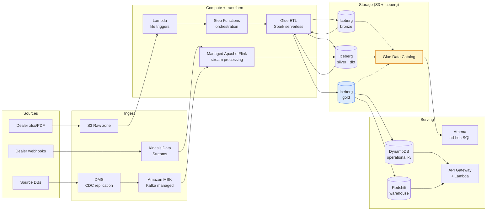

# Solution D — AWS Big Data + Streaming (my executive brief)

> *S3 + Apache Iceberg · Glue Catalog · Kinesis · MSK · Lambda · Step Functions · Athena · Redshift · DMS · DynamoDB*
>
> This is the architecture I'd recommend when AWS is the corporate standard, multi-region is required, and ops simplicity matters more than vendor flexibility.

---

## My 60-second pitch

In my view, AWS's data + streaming services, composed natively, give you the same architectural shape as my Solution B (Iceberg lakehouse + streaming bus + dbt-style transformations + analytical query engine) — but with every component managed by AWS. The trade I'm making is vendor lock-in and ~30% higher cost in exchange for "I don't run Kafka, I don't run Iceberg metadata service, I don't run dbt Cloud myself".

---

## My architecture sketch

The Iceberg + Glue Catalog combination is doing the work that the Lakehouse / OneLake combination does on Fabric. Different vendor, same architectural shape in my view.

---

## What I think D does that B (open-source self-host) doesn't

| Capability | AWS native | OSS B equivalent |
|---|---|---|
| **Managed Kafka (MSK)** | One CloudFormation click | Self-host Redpanda or Confluent Cloud |
| **Managed Flink** | Kinesis Data Analytics for Flink | Run Flink yourself / RisingWave |
| **Glue Data Catalog** | Multi-engine, multi-region | Apache Hive Metastore + Trino catalog |
| **Step Functions visual DAG** | Native | Dagster |
| **Athena ad-hoc SQL on S3** | Pay-per-query | Trino on MinIO/S3 |
| **DMS database replication** | Source → S3 with CDC | Debezium + Iceberg writer |
| **VPC + IAM + KMS** | Native, deeply integrated | Vault + Terraform per service |
| **CloudWatch + X-Ray observability** | Default-on | OpenTelemetry + collector + Prometheus + Grafana |
| **Multi-region replication** | S3 + Kinesis cross-region native | Custom |

For an AWS-committed organisation, every row above is "click to configure" instead of "stand up infrastructure" in my view. For a non-AWS-committed organisation, every row is also "your data lives in AWS forever" — the lock-in is real.

---

## My honest cost economics

AWS managed services carry roughly a 30% markup over self-hosted equivalents on equivalent workloads, in my experience. The numbers below are my estimates for 1,000 dealers/week steady state:

| Component | Estimated monthly | Note |
|---|---|---|
| S3 storage (50 TB Iceberg) | $1,150 | Standard tier |
| Glue Catalog | $1 per million requests | Negligible at this scale |
| Glue ETL (Spark) | $400 | DPU-hours dominated by daily medallion runs |
| Kinesis Data Streams | $50 | 10 shards, ~10M events/month |
| MSK | $400 | 3-broker, m5.large, modest |
| Managed Flink | $300 | Small KPU |
| Lambda (file triggers) | $20 | Sub-million invocations |
| Step Functions | $30 | Workflow executions |
| Athena | $5 | Ad-hoc, scanned ~10 TB/month |
| Redshift Serverless | $400 | RPU-hours, modest analytics |
| DynamoDB (operational) | $50 | On-demand pricing |
| API Gateway | $30 | ~1M requests/month |
| CloudWatch + X-Ray | $80 | Logs + traces |
| **Total** | **~$2,900/month** | At 1,000 dealers ≈ **$2.90/dealer** |

Compared to my Solution B self-hosted at ~$0.50/dealer at the same scale, AWS is **~5× more expensive** at this size. In my view the justification is *not* cost — it's:

- No DevOps headcount needed
- Multi-region replication trivial
- VPC + IAM + KMS gives me compliance defaults
- AWS Marketplace + Bedrock + SageMaker integrations available

---

## When I'd say D is the right answer

| Situation | AWS? |
|---|---|
| Company is AWS-committed corporate standard | ✅ Strongly |
| Multi-region or global compliance | ✅ AWS has the broadest region coverage |
| Need vendor-managed throughout | ✅ Yes |
| Streaming + batch unified, high volume | ✅ MSK + Kinesis + Iceberg native |
| Want SageMaker / Bedrock for ML | ✅ Tight integration |
| Per-dealer ops cost matters more than infra cost | ✅ Lower DevOps headcount |
| Cost optimization is critical | ❌ B (self-host) is ~5× cheaper in my estimate |
| Open-source-first / vendor-portable culture | ❌ Heavy AWS lock-in |
| Microsoft is the corporate standard | ❌ Use Fabric instead |
| Small data (<10 TB) | ❌ Over-engineered, in my view |

---

## What I'd do differently from a textbook AWS reference architecture

If I were actually deploying D, my deviations from AWS's reference architectures would be:

1. **Iceberg on S3, not Delta Lake on S3.** AWS recently improved Delta Lake support; I'd still pick Iceberg for vendor-portability if the migration trigger ever fires the other way.

2. **Trino on EMR Serverless instead of Athena for hot-path analytics.** Athena's per-query billing is excellent for ad-hoc; for production catalog queries hit many times per minute, I think Trino self-managed (or via Starburst) is cheaper.

3. **dbt-core on ECS Fargate instead of dbt Cloud.** I find dbt Cloud's per-developer pricing hard to justify at small team sizes. ECS Fargate + dbt-core + scheduled task is ~$30/month total.

4. **DynamoDB only for hot-path catalog reads, not as the source of truth.** Source of truth is Iceberg Gold. DynamoDB is a sync target with TTL, populated by Step Function tasks. This avoids "DynamoDB went out of sync with the lakehouse" debugging — a failure mode I've seen.

5. **CDC via DMS into Iceberg directly, not into S3 staging first.** Reduces lag. Requires DMS target compatibility (improved as of 2025).

6. **Bedrock for LLM calls instead of OpenAI/Anthropic direct.** Bedrock keeps the data in the AWS VPC, satisfies data-residency conversations, and the model gateway pattern (Claude, Mistral, Titan all behind one API) means swapping models is configuration not rewrite.

These deviations come from me operating mixed AWS environments alongside Fabric and OSS lakehouses across my work history. In my view AWS's defaults are sensible but not optimal for every workload.

---

## My verdict for InventoryFlow

**Not now, and probably not as my primary recommendation ever** — I documented Solution D as the *credible alternative* if InventoryFlow's parent company turns out to be AWS-standardised. The probability of that is non-zero but unannounced.

My reason to include D at all: I think senior engineers shouldn't have to choose between B (open-source self-host) and "we'll figure it out". For an AWS-aligned company, D is the answer that already exists.

---

**Next:** [06-llm-strategy.md](./06-llm-strategy.md) — the AI-tooling deep dive.
