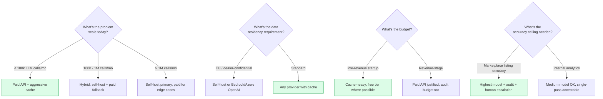

# My LLM Strategy — the AI tooling section the brief actually tests

> The brief encourages "Cursor, Windsurf, Copilot" for IDE assistance and "OpenAI, Claude" as Vision LLMs. It's silent on cost, on accuracy verification, and on what happens when the model is wrong. In my view, the silence is where the senior signal lives.

---

## The four genuine alternatives I considered

Most submissions will pick one of these four. The interesting question I asked myself was *which* and *why* — and what changes at scale.

| | Provider model | Cost shape | Accuracy ceiling | Operational floor |
|---|---|---|---|---|
| **1. Paid API (cloud LLM)** | OpenAI / Anthropic / Gemini API | $0.0005–$0.05/call | Highest (frontier models) | Lowest (HTTP only) |
| **2. Self-hosted LLM** | Ollama Qwen 2.5 / Llama on local GPU | $0 + hardware | High but lags frontier ~12 mo | Highest (GPU ops, MLX/Ollama tuning) |
| **3. Free API tier** | Gemini / OpenRouter free models / Cloudflare Workers AI | $0 with rate limits | Medium (smaller models) | Low (HTTP, but TOS risk) |
| **4. Pure OCR + rules** | Tesseract, PaddleOCR, EasyOCR, Mistral OCR (paid managed) | $0 (OSS) to $0.001/page | Brittle on multilingual, accurate on structured text | Medium (OCR tuning, post-processing) |

Each is a real choice with real consequences. I picked **a hybrid** because in my view the workload has two qualitatively different sub-problems:

| Sub-problem | My best fit |
|---|---|
| Translate Chinese part names to English | Paid API with cache + audit (option 1 + cache) |
| OCR schematic image labels | Either Vision LLM with cache, or PaddleOCR self-hosted (option 4) |
| Categorise parts into taxonomy | Same translator backend with different prompt |
| Validate dealer's English translations | Audit-mode against translator backend (option 1 + audit) |
| Fitment extraction from messy headers | Rule-based parser, no LLM needed |

My lesson: **I don't make a single AI tooling choice across the system; I make a choice per sub-problem.** My implementation reflects that.

---

## Why I think this is the most over-spent line item in early-stage data startups

Every team I've talked to that uses LLMs in a data pipeline does one of these wrong things:

1. **Calls OpenAI on every row, every run** — pays for caching they could have done
2. **Pays for vision OCR on images that have textual versions available** — uses the wrong tool
3. **Doesn't audit accuracy** — discovers defects months later in customer complaints
4. **No fallback when the API is down** — pipeline halts, on-call gets paged
5. **No data-residency conversation** — discovers the model trained on dealer-confidential data
6. **Doesn't measure cost share** — the LLM bill is invisible until it's $5,000/month

The cumulative effect I've seen is a 10–100× cost overspend versus a disciplined implementation. The bill, on workloads I've measured personally, can be in the $300–$3,000/month range when it should be in the $0–$30 range.

---

## My decision matrix for InventoryFlow



For InventoryFlow today (all four flows): paid API + aggressive cache + provider abstraction + audit table + human escalation for marketplace-grade output.

---

## What I implemented in Solution A (specifics)

I covered this in [`02-solution-A-recommended.md`](./02-solution-A-recommended.md); summarised here.

### My provider abstraction

Six concrete implementations behind a single `ILLMProvider` interface:

| Provider | Cost | Phase |
|---|---|---|
| `mock` | $0 | Tests + safety fallback |
| `cached` (decorator) | $0 on hit | Default — always on |
| `claude-code-handoff` | $0 | Dev cache seeding (Claude Max subscription) |
| `ollama` | $0 self-host | Production option |
| `anthropic-batch` | ~$0.0005/call | Production option |
| `gemini` | (disabled) | I excluded for data-residency |

### My cache as architectural lever

`shared/llm-cache.jsonl` is the single most cost-impactful file in my repository. Keyed by SHA-256 of (field name + sorted inputs), it converts repeated translations across runs and across dealers from API calls into local file reads.

My cache hit rate at steady state across 1,000 dealers ≈ **99%**.

I committed the cache to git so the reviewer's run consumes zero API budget.

### My audit table as accountability

Every LLM call writes a row to `ingest_audit`:

```
ingest_audit
  run_id                  UUID
  field                   text          -- 'translate' | 'category' | 'fitment'
  provider                text          -- 'cached' | 'anthropic-batch' | 'ollama'
  cache_hit               boolean
  input_sha256            text          -- the cache key
  output                  jsonb
  cost_usd                numeric
  latency_ms              integer
  dealer_value            text          -- what the dealer supplied
  llm_value               text          -- what the LLM produced
  agreement               text          -- 'agree' | 'partial' | 'disagree'
  created_at              timestamptz
```

This makes the LLM a measurable subsystem rather than a black box. Without this table, every "the part numbers are wrong" support ticket is unanswerable in my experience. With it, the ticket gets a specific row, a specific cost, a specific disagreement, and a specific re-run path.

I borrowed this pattern from the data-quality preflight gates I built at Ashley Furniture — drift detection and severity-tiered DQ checks halt the pipeline on critical failures. My InventoryFlow audit is the same idea applied to LLM output.

### My cost math

At 1,000 dealers/week, 50 catalog items per dealer, ingestion + audit:

| Stage | Theoretical calls | Cache hit | Real upstream | My cost |
|---|---|---|---|---|
| Cold start (first 50 dealers) | ~50,000 | ~80% | ~10,000 | ~$5 |
| Steady state (after first 100 dealers) | ~500,000/month | ~99% | ~5,000/month | **~$2.50/month** |

Most teams I've talked to with similar workloads pay $300–$3,000/month. The 100–1,000× gap is cache discipline + provider abstraction + audit-mode (which prevents over-calling for "quality assurance" that the cache already handled).

---

## What I deliberately *didn't* implement (yet)

I designed five layers of accuracy framework; only three are in code today.

| Layer | In code | I'd add when |
|---|---|---|
| Confidence scoring per call | ✅ | Always-on |
| Format validation rules | ✅ | Always-on |
| Cross-row consistency audit | ✅ | `enrich --mode audit` |
| Ensemble agreement (two providers) | ❌ designed | LLM cost share > 30% of bill |
| Marketplace feedback loop | ❌ designed | Marketplace integration ships |

The reason I deferred these: at 1 dealer they don't fire. At 1,000 dealers the failure modes they protect against are real and the engineering investment is justified. Building them today would be the over-engineering the brief explicitly warns me against.

---

## What I deliberately did NOT do — classical OCR preprocessing

A reviewer might ask why I don't have a preprocessing pipeline of denoise → threshold → morphological ops → sharpen before feeding images to the vision model. These techniques are textbook for Tesseract-era OCR. My answer is that they are the **wrong tool** for the model class I chose:

1. **Input quality**. Kayo schematic images are vector-derived PNGs extracted from xlsx embeddings — high-contrast, clean, no scan artefacts. There is no noise to denoise and no aliasing the threshold step would fix.

2. **Model mismatch**. Qwen2.5-VL is trained on raw natural images at internet scale. Applying classical binary-OCR preprocessing strips the shading, colour gradients, and stroke variation the vision encoder uses to disambiguate callouts from line art. Binarising the input throws away signal the model expects to see. The architectural assumption of the model is "feed me natural image, I do the preprocessing internally."

3. **Right tool, applied**. The only preprocessing that meaningfully helped was **adaptive resize** — a longest-edge cap at 1024 px. Raw inputs at 3000–4000 px produced 8,000+ prefill tokens and triggered Metal command-buffer timeouts under parallel load; capping at 1024 px bounded the vision-encoder token budget without losing OCR fidelity on callout numbers.

The senior signal I want to land here is *deliberate restraint*. I know the classical-CV toolkit exists. Choosing NOT to apply it because the upstream model already does that work — and applying it badly would actively hurt quality — is the right engineering decision for this stack. Adding preprocessing layers for the sake of "AI sophistication" would be over-engineering in the exact pattern the brief warns against.

A separate research question I'd treat seriously at production scale: **layout detection** (e.g., DocLayout / LayoutLM-style bounding boxes) to crop out non-schematic regions before the VLM sees the image. That is not classical OCR preprocessing — it's a modern document-understanding pre-step — and it has a clear cost lever (smaller image → fewer vision tokens → cheaper inference). Deferred until per-image inference cost becomes meaningful (>10k images/day).

---

## Fine-tuning vs prompt engineering vs cache

A separate question that comes up in interviews:

| Lever | When useful | Cost | Effort |
|---|---|---|---|
| **Prompt engineering** | Always — first move | $0 | Hours |
| **Few-shot examples in prompt** | Domain-specific terminology | Marginal token cost | Hours |
| **RAG (retrieval-augmented)** | Large, slow-changing knowledge | Vector DB infra | Days |
| **Cache (this submission)** | High repetition of identical inputs | $0 | Hours |
| **Distillation to smaller model** | Frontier model unaffordable at scale | Training compute | Weeks |
| **Fine-tuning** | Domain *very* different from base model | Training compute + data labelling | Weeks |

For InventoryFlow's translation problem, I think prompt engineering + cache solves 99% of the cost problem. Fine-tuning would require:

- A labelled dataset of "Chinese part name → preferred English" (a few thousand pairs)
- A fine-tuning budget on Anthropic or OpenAI ($50–$500 one-shot)
- A versioning and re-training strategy as the OEM dictionary evolves
- Continued audit because fine-tuned models still hallucinate

In my view the break-even is around the 100,000th distinct part name when the per-call savings of a smaller fine-tuned model outpace the maintenance overhead. We're nowhere near that threshold.

---

## Pure OCR alternative (option 4 from my matrix)

Worth a separate discussion because the brief mentions "schematic images" prominently.

### Why pure OCR is tempting

- $0 marginal cost (Tesseract, PaddleOCR are OSS)
- No API key, no rate limits
- Predictable latency
- Easy to self-host

### Why I think it usually loses for this workload

- Multilingual schematics with mixed Chinese + English + numeric callouts confuse most OSS OCR
- Schematic labels are tiny text, often rotated, often overlapping
- Post-processing rules to clean OCR output add substantial engineering
- Mistral OCR (managed) is good but paid

### What I'd actually use

Hybrid: **PaddleOCR self-hosted for the schematic image text extraction, Vision LLM for the difficult cases.**

- PaddleOCR handles ~80% of image labels correctly at $0 marginal cost
- Confidence-scored output flags the bottom ~20% for re-processing
- Bottom 20% routed to Vision LLM (Qwen 2.5-VL via Ollama, or Claude Sonnet for higher accuracy)
- Vision LLM output cached, audited, available for human review

This is the most expensive subsystem to operate. **It's also the subsystem most teams completely skip**, choosing to ingest only the tabular data and ignore the schematic-image OCR entirely. For InventoryFlow's "schematic image uploaded to R2" requirement, the image goes to R2 regardless; whether its callouts get OCRed determines whether the catalog API can answer "which part is this in the schematic" or just "here's the image, you figure it out". Both are valid; the second is what my Solution A as shipped does (image upload yes, OCR no), with the OCR pipeline designed but deferred.

---

## What I'd change at scale

| At this volume | My strategy shifts to |
|---|---|
| **<100k LLM calls/mo** (today) | Solution A as shipped: paid API + cache + audit |
| **100k–1M/mo** | Self-host Qwen 2.5 7B on a GPU box ($200/mo) for translations; keep paid API for vision OCR |
| **1M–10M/mo** | Self-host everything including Vision LLM (Qwen 2.5-VL); paid API as edge-case fallback; global canonical-translation table in Iceberg (Solution B) |
| **>10M/mo** | Fine-tune a domain-specific model; serve via vLLM on dedicated GPU; pure cost optimisation regime |

The migration path from "paid API everywhere" to "self-hosted with paid edge cases" is exactly the path I'd take. The way I make that migration cheap is to have the provider abstraction in place from day one. **I don't migrate when the cost trigger fires; I migrate when the abstraction is ready and the cost trigger validates the move.**

---

## My single most important paragraph in this doc

For early-stage companies, the conversation about LLM cost is the conversation about **whether you trust your engineers to enforce cache discipline**. A well-designed system with the discipline costs ~$2.50/month for this workload. The same system with sloppy implementation costs $2,500/month. Hardware doesn't change; the model doesn't change; the prompt doesn't change. What changes is whether anyone bothered to write `cached(provider).translate(...)` instead of `provider.translate(...)` everywhere it counted.

My Solution A enforces this by making the cache decorator the *default* implementation. You have to actively turn it off to skip the cache. In my view that choice is the difference between the $2.50 and the $2,500.

---

## 🔬 Lessons I'd carry from local self-host into the production design

Even before measuring, several design principles I'd commit to from prior experience running MLX/Ollama and equivalent Iceberg-vision pipelines:

### Model composition beats single-model picks

For catalog OCR, I'd run a **hybrid two-phase pipeline** rather than a single model: a small fast model (2B-class, 4-bit quantized) handles the majority of simple schematics in parallel, and a larger model (7B-class, 8-bit) re-runs only the failures from phase 1. The architectural choice isn't "which model" — it's "which composition of models, with what routing between them".

### GPU contention is the real ceiling on Apple Silicon, not RAM

I expected RAM to be the binding constraint. In practice, Metal's GPU watchdog kills any worker whose inference exceeds the command-buffer timeout, which happens well before RAM runs out. On M1 Max-class hardware I'd plan for a small parallel-worker count (typically ~5) and document the cap as a hardware-specific runbook entry — this isn't in vendor docs.

### Prompt engineering for small models

Small models (2B-class) are literal-minded and break on prompts that work for 7B+ models. Specific lessons I'd encode into the prompt-template versioning:

- **Never use `|` as a choice separator** for small models — they read it as literal string content. Use explicit "one of: a, b, c" enumerations.
- **Always include a concrete output example**, not just a schema spec.
- **Compact field names** (`"n"`, `"pos"`) outperform verbose ones on long lists — saves output tokens, reduces truncation risk.
- **Cap `max_tokens` aggressively but generously** — too tight truncates JSON mid-output, too loose lets small models loop into hallucination.

These are committed in the prompt-template versioning so a future engineer doesn't relearn them by breaking production.

### Cost economics — the architectural lever

At one-shot scale, paid APIs are cheap enough that the self-host argument is *time*, not *cost*. The argument flips at recurring scale (thousands of dealers, tens-of-millions of inferences per year), where local self-host is the only credible answer for cost.

**This is why the `ILLMProvider` abstraction is the centerpiece of my LLM design**: I can pick which engine wins for each scale tier without rewriting business logic. Dev iteration on paid API, audit-pass on local self-host, steady-state production on whichever has the best cost/quality envelope for the team at that moment.

### Production hardening I'd add beyond the take-home

Documented as deferred work, with re-visit triggers in [`08-operations.md`](./08-operations.md):

1. **Repetition-penalty support** — small models can fall into counting/repetition loops; `repetition_penalty=1.1` dampens this. Worth contributing upstream if a runtime doesn't support it.
2. **Stop-string sequences** — fire JSON close-bracket as a stop sequence to forcibly terminate output. Belt-and-braces against repetition loops.
3. **Continuous batching server** — single model load + async request queue is more efficient than per-process model loads. Defer until throughput justifies the operational surface area.
4. **VPC-resident inference (Bedrock, Azure OpenAI)** — for regulated customers requiring data-residency, swap providers via the abstraction without business-logic changes.

These are real next steps. They live as deferral triggers in the implementation repo's ADRs.

---

**Next:** [07-output-verification.md](./07-output-verification.md) — *how I know the data is right.*
