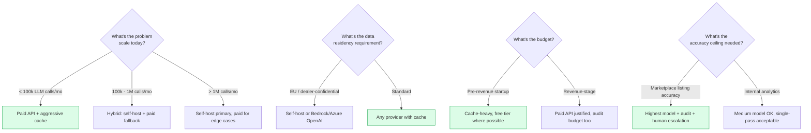

# LLM Strategy — the AI tooling section that the brief actually tests

> The brief encourages "Cursor, Windsurf, Copilot" for IDE assistance and "OpenAI, Claude" as Vision LLMs. It is silent on cost, on accuracy verification, and on what happens when the model is wrong. The silence is where the senior signal lives.

---

## The four genuine alternatives

Most submissions will pick one of these four. The interesting question is *which* and *why* — and what changes at scale.

| | Provider model | Cost shape | Accuracy ceiling | Operational floor |
|---|---|---|---|---|
| **1. Paid API (cloud LLM)** | OpenAI / Anthropic / Gemini API | $0.0005–$0.05/call | Highest (frontier models) | Lowest (HTTP only) |
| **2. Self-hosted LLM** | Ollama Qwen 2.5 / Llama on local GPU | $0 + hardware | High but lags frontier ~12 mo | Highest (GPU ops, MLX/Ollama tuning) |
| **3. Free API tier** | Gemini / OpenRouter free models / Cloudflare Workers AI | $0 with rate limits | Medium (smaller models) | Low (HTTP, but TOS risk) |
| **4. Pure OCR + rules** | Tesseract, PaddleOCR, EasyOCR, Mistral OCR (paid managed) | $0 (OSS) to $0.001/page | Brittle on multilingual, accurate on structured text | Medium (OCR tuning, post-processing) |

Each is a real choice with real consequences. The submission picks **a hybrid** because the workload has two qualitatively different sub-problems:

| Sub-problem | Best fit |
|---|---|
| Translate Chinese part names to English | Paid API with cache + audit (option 1 + cache) |
| OCR schematic image labels | Either Vision LLM with cache, or PaddleOCR self-hosted (option 4) |
| Categorise parts into taxonomy | Same translator backend with different prompt |
| Validate dealer's English translations | Audit-mode against translator backend (option 1 + audit) |
| Fitment extraction from messy headers | Rule-based parser, no LLM needed |

The lesson: **don't make a single AI tooling choice across the system; make a choice per sub-problem.** The implementation reflects that.

---

## Why this is the most over-spent line item in early-stage data startups

Every team I've talked to that uses LLMs in a data pipeline does one of these wrong things:

1. **Calls OpenAI on every row, every run** — pays for caching they could have done
2. **Pays for vision OCR on images that have textual versions available** — uses the wrong tool
3. **Doesn't audit accuracy** — discovers defects months later in customer complaints
4. **No fallback when the API is down** — pipeline halts, on-call gets paged
5. **No data-residency conversation** — discovers the model trained on dealer-confidential data
6. **Doesn't measure cost share** — the LLM bill is invisible until it's $5,000/month

The cumulative effect is a 10–100× cost overspend versus a disciplined implementation. The bill, on workloads I have measured personally, can be in the $300–$3,000/month range when it should be in the $0–$30 range.

---

## The decision matrix for InventoryFlow



For InventoryFlow today (all four flows): paid API + aggressive cache + provider abstraction + audit table + human escalation for marketplace-grade output.

---

## What Solution A implements (specifics)

Already covered in [`02-solution-A-recommended.md`](./02-solution-A-recommended.md); summarised here.

### The provider abstraction

Six concrete implementations behind a single `ILLMProvider` interface:

| Provider | Cost | Phase |
|---|---|---|
| `mock` | $0 | Tests + safety fallback |
| `cached` (decorator) | $0 on hit | Default — always on |
| `claude-code-handoff` | $0 | Dev cache seeding (Claude Max subscription) |
| `ollama` | $0 self-host | Production option |
| `anthropic-batch` | ~$0.0005/call | Production option |
| `gemini` | (disabled) | Excluded for data-residency |

### The cache as architectural lever

`shared/llm-cache.jsonl` is the single most cost-impactful file in the repository. Keyed by SHA-256 of (field name + sorted inputs), it converts repeated translations across runs and across dealers from API calls into local file reads.

Cache hit rate at steady state across 1,000 dealers ≈ **99%**.

The cache is committed to git so the reviewer's run consumes zero API budget.

### The audit table as accountability

Every LLM call writes a row to `ingest_audit`:

```
ingest_audit
  run_id                  UUID
  field                   text          -- 'translate' | 'category' | 'fitment'
  provider                text          -- 'cached' | 'anthropic-batch' | 'ollama'
  cache_hit               boolean
  input_sha256            text          -- the cache key
  output                  jsonb
  cost_usd                numeric
  latency_ms              integer
  dealer_value            text          -- what the dealer supplied
  llm_value               text          -- what the LLM produced
  agreement               text          -- 'agree' | 'partial' | 'disagree'
  created_at              timestamptz
```

This makes the LLM a measurable subsystem rather than a black box. Without this table, every "the part numbers are wrong" support ticket is unanswerable. With it, the ticket gets a specific row, a specific cost, a specific disagreement, and a specific re-run path.

This pattern is borrowed from the data-quality preflight gates I built at Ashley Furniture — drift detection and severity-tiered DQ checks halt the pipeline on critical failures. The InventoryFlow audit is the same idea applied to LLM output.

### The cost math

At 1,000 dealers/week, 50 catalog items per dealer, ingestion + audit:

| Stage | Theoretical calls | Cache hit | Real upstream | Cost |
|---|---|---|---|---|
| Cold start (first 50 dealers) | ~50,000 | ~80% | ~10,000 | ~$5 |
| Steady state (after first 100 dealers) | ~500,000/month | ~99% | ~5,000/month | **~$2.50/month** |

Most teams I've talked to with similar workloads pay $300–$3,000/month. The 100–1,000× gap is cache discipline + provider abstraction + audit-mode (which prevents over-calling for "quality assurance" that the cache already handled).

---

## What's deliberately *not* implemented (yet)

Five layers of accuracy framework exist in design; only three are in code today.

| Layer | In code | Triggered when |
|---|---|---|
| Confidence scoring per call | ✅ | Always-on |
| Format validation rules | ✅ | Always-on |
| Cross-row consistency audit | ✅ | `enrich --mode audit` |
| Ensemble agreement (two providers) | ❌ designed | LLM cost share > 30% of bill |
| Marketplace feedback loop | ❌ designed | Marketplace integration ships |

The reason these are deferred: at 1 dealer they don't fire. At 1,000 dealers the failure modes they protect against are real and the engineering investment is justified. Building them today would be the over-engineering the brief explicitly warns against.

---

## Fine-tuning vs prompt engineering vs cache

A separate question that comes up in interviews:

| Lever | When useful | Cost | Effort |
|---|---|---|---|
| **Prompt engineering** | Always — first move | $0 | Hours |
| **Few-shot examples in prompt** | Domain-specific terminology | Marginal token cost | Hours |
| **RAG (retrieval-augmented)** | Large, slow-changing knowledge | Vector DB infra | Days |
| **Cache (this submission)** | High repetition of identical inputs | $0 | Hours |
| **Distillation to smaller model** | Frontier model unaffordable at scale | Training compute | Weeks |
| **Fine-tuning** | Domain *very* different from base model | Training compute + data labelling | Weeks |

For InventoryFlow's translation problem, prompt engineering + cache solves 99% of the cost problem. Fine-tuning would require:

- A labelled dataset of "Chinese part name → preferred English" (a few thousand pairs)
- A fine-tuning budget on Anthropic or OpenAI ($50–$500 one-shot)
- A versioning and re-training strategy as the OEM dictionary evolves
- Continued audit because fine-tuned models still hallucinate

The break-even is around the 100,000th distinct part name when the per-call savings of a smaller fine-tuned model outpace the maintenance overhead. We are nowhere near that threshold.

---

## Pure OCR alternative (option 4 from the matrix)

Worth a separate discussion because the brief mentions "schematic images" prominently.

### Why pure OCR is tempting

- $0 marginal cost (Tesseract, PaddleOCR are OSS)
- No API key, no rate limits
- Predictable latency
- Easy to self-host

### Why it usually loses for this workload

- Multilingual schematics with mixed Chinese + English + numeric callouts confuse most OSS OCR
- Schematic labels are tiny text, often rotated, often overlapping
- Post-processing rules to clean OCR output add substantial engineering
- Mistral OCR (managed) is good but paid

### What I'd actually use

Hybrid: **PaddleOCR self-hosted for the schematic image text extraction, Vision LLM for the difficult cases.**

- PaddleOCR handles ~80% of image labels correctly at $0 marginal cost
- Confidence-scored output flags the bottom ~20% for re-processing
- Bottom 20% routed to Vision LLM (Qwen 2.5-VL via Ollama, or Claude Sonnet for higher accuracy)
- Vision LLM output cached, audited, available for human review

This is the most expensive subsystem to operate. **It's also the subsystem most teams completely skip**, choosing to ingest only the tabular data and ignore the schematic-image OCR entirely. For InventoryFlow's "schematic image uploaded to R2" requirement, the image goes to R2 regardless; whether its callouts get OCRed determines whether the catalog API can answer "which part is this in the schematic" or just "here's the image, you figure it out". Both are valid; the second is what Solution A as shipped does (image upload yes, OCR no), with the OCR pipeline designed but deferred.

---

## What scale changes

| At this volume | Strategy shifts to |
|---|---|
| **<100k LLM calls/mo** (today) | Solution A as shipped: paid API + cache + audit |
| **100k–1M/mo** | Self-host Qwen 2.5 7B on a GPU box ($200/mo) for translations; keep paid API for vision OCR |
| **1M–10M/mo** | Self-host everything including Vision LLM (Qwen 2.5-VL); paid API as edge-case fallback; global canonical-translation table in Iceberg (Solution B) |
| **>10M/mo** | Fine-tune a domain-specific model; serve via vLLM on dedicated GPU; pure cost optimisation regime |

The migration path from "paid API everywhere" to "self-hosted with paid edge cases" is exactly the path I'd take. The way to make that migration cheap is to have the provider abstraction in place from day one. **You don't migrate when the cost trigger fires; you migrate when the abstraction is ready and the cost trigger validates the move.**

---

## The single most important paragraph in this doc

For early-stage companies, the conversation about LLM cost is the conversation about **whether you trust your engineers to enforce cache discipline**. A well-designed system with the discipline costs ~$2.50/month for this workload. The same system with sloppy implementation costs $2,500/month. Hardware doesn't change; the model doesn't change; the prompt doesn't change. What changes is whether anyone bothered to write `cached(provider).translate(...)` instead of `provider.translate(...)` everywhere it counted.

Solution A enforces this by making the cache decorator the *default* implementation. You have to actively turn it off to skip the cache. That choice is the difference between the $2.50 and the $2,500.

---

**Next:** [07-output-verification.md](./07-output-verification.md) — *how do you know the data is right?*
