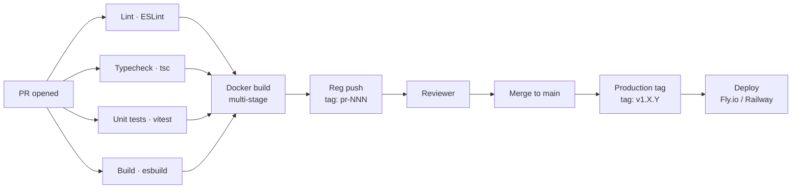

# Operations — CI/CD, Security, Observability, Scale, Governance

> The brief doesn't itemise these. In my view, senior architects don't get to skip them.

---

## CI/CD

### What I shipped with Solution A today

My GitHub Actions workflow (`.github/workflows/ci.yml` in the impl repo):



Concrete checks I run on every PR:

1. **Lint** — ESLint with TypeScript + import sorting
2. **Typecheck** — `tsc --noEmit` (zero errors required)
3. **Unit tests** — Vitest, 32 tests, ~400 ms wall-time
4. **Build** — Production esbuild, sourcemaps, tree-shaking
5. **Docker build** — Multi-stage; my output is ~80 MB Alpine image; non-root user
6. **Vulnerability scan** — Trivy on the built image (I deferred this to year 2)

I tag the container image with the PR number for reviewer testing in a per-PR ephemeral environment.

### My multi-environment promotion pattern

This is the pattern I use at Ashley Furniture today, simplified for InventoryFlow:

```
main → built image → tagged v1.X.Y
                       ↓
              ┌────────┼────────┐
              ↓        ↓        ↓
            DEV      TEST     PROD
         (auto)  (manual)  (manual + approval)
```

Two non-negotiable rules I took from the Ashley experience:

1. **Side-by-side non-destructive deploys.** When I deploy v10, I keep v9 fully alive until v10 passes parity gates. The cutover is a config flag flip, not a code deploy. In my experience this is the only deploy pattern I've seen survive contact with production traffic.

2. **DEV → TEST → PROD with explicit gates.** Each environment has explicit acceptance criteria I define (smoke tests pass; benchmarks within 10% of prior version; audit table shows expected LLM cost share). No implicit promotions.

For InventoryFlow at current scale, "PROD" is a single Fly.io machine. The pattern still applies — the cutover discipline is the point for me, not the infrastructure.

### My schema migration approach

Drizzle Kit produces migrations as SQL files I commit to git:

```
migrations/
├── 0001_nulls_not_distinct.sql       ← idempotency-critical
├── 0002_row_level_security.sql       ← multi-tenant ready
└── 0003_audit_table.sql              ← LLM accountability
```

I run migrations in a transaction; if any statement fails, the migration is rolled back. The runner records applied migrations in a `_drizzle_migrations` table.

Two patterns I applied from Ashley here:
- **`.sqlproj` DacFx parallel** — Build-time schema validation; my PR review catches DDL errors before merge
- **Schema diff publish via SqlPackage** — At Ashley I use SqlPackage for non-destructive Warehouse schema deploys. For InventoryFlow's Postgres scale, Drizzle Kit's migration runner is my equivalent

### My cutover gate from A → B (year 2+)

I documented this separately in [`03-solution-B-de-standard.md`](./03-solution-B-de-standard.md). My non-negotiable elements:

- 7 days of shadow-mode operation (B running silent alongside A)
- Row-count parity within 0.01%
- Latency parity within 10%
- Audit-finding agreement within 5%
- A signed cutover approval (literal name on a PR)

Skip any of these and someone gets paged at 2 AM.

---

## Security

### My secrets management

Solution A uses `.env` files for local development; production secrets come from the deployment platform's secret store (Fly.io secrets, Railway secrets, or HashiCorp Vault for self-host).

What I deliberately don't put in the repo:
- No API keys committed (`.env.example` lists the variables; values are platform-managed)
- No service account JSON files
- No cloud credentials in code

What I do put in the repo:
- `.env.example` with documentation of every env var
- Pre-commit hook (`git-secrets` or similar) to prevent accidental commits

### My database security

| Concern | My mechanism |
|---|---|
| **Row-level security** | I enabled RLS policies on `products`, `product_images`, `ingest_audit`; per-dealer scoping when multi-tenant is real |
| **Column-level access** | Reserved for sensitive future columns (pricing, supplier costs) |
| **SQL injection** | Drizzle parameterised queries; no string concatenation |
| **Connection encryption** | TLS required on prod; cert pinning planned for year 2 |
| **Backup encryption** | Provider-managed (AWS RDS / Supabase / Neon defaults) |
| **Audit trail** | I log every write with `run_id` + `actor` (user or service principal) |

I added the RLS pattern (migration 0002) as one of the things I wouldn't skip even at single-dealer scale. In my view it's the difference between "we'll add multi-tenancy later" (which means major rewrite) and "we're already multi-tenant, we just have one tenant today" (which means a config change).

### My storage security

Cloudflare R2:
- Per-dealer prefix: `dealer/<id>/sha256/...` (my default)
- IAM-equivalent via R2 API tokens with scoped buckets
- Signed URLs for marketplace consumers with short TTL
- No public-read by default — explicit signed-URL access

### My authentication & authorisation

My Fastify API uses JWT bearer tokens with claims for dealer ID and role. Refresh-token rotation, RBAC at the route level. Standard patterns; no clever inventions.

### What I deliberately deferred

| Concern | Why I deferred |
|---|---|
| Per-row encryption at rest | Postgres TDE + R2 default encryption sufficient |
| SOC 2 / ISO 27001 controls | Pre-product-market-fit company; revisit when enterprise customers ask |
| WAF / DDoS protection | Cloudflare in front of Fly.io covers most; explicit WAF on revenue stage |
| Penetration testing | Year 2 |
| Bug bounty programme | Year 3 |

My pattern: **explicit deferrals over invisible omissions.** Every item above has a re-visit trigger.

---

## Observability

### My three pillars

| Pillar | My implementation | Backend |
|---|---|---|
| **Logs** | Pino structured JSON with `run_id` correlation | Vector → ClickHouse / Loki (env-specific) |
| **Metrics** | Prometheus `/metrics` endpoint (placeholder) | Self-hosted Prometheus + Grafana |
| **Traces** | OpenTelemetry SDK instrumented | OTLP exporter; backend TBD |

My deliberate choice: instrument now, choose backends later. The instrumentation is what's expensive to retrofit in my experience. The backend is a config flag.

### What I log

```
{
  "level": "info",
  "time": "2026-05-12T14:23:01.123Z",
  "run_id": "abc-123",
  "stage": "parse-sheet",
  "sheet_name": "Predator 125 Body",
  "rows_total": 234,
  "rows_normalised": 234,
  "rows_failed": 0,
  "duration_ms": 487
}
```

Every log line correlated by `run_id`. I make the Pino + `run_id` pattern mandatory because in my experience debugging a multi-worker BullMQ pipeline without correlation is the most time-consuming form of operational work. It's also the most preventable.

### My audit table as observability

`ingest_audit` is part of my observability story, not just LLM accountability. Queries against it answer:

- "What was the LLM cost share last month?"
- "Which dealer had the highest disagreement rate?"
- "Which `name_cn` strings caused the most re-translations?"
- "What was the cache hit rate for the last 30 days?"

I borrowed this pattern from Ashley — the registry + audit ledger tables that make platform assessment repeatable. My InventoryFlow audit is one table; at Ashley it's a small constellation.

### My alerting (designed, deferred)

| Alert | Trigger | Severity |
|---|---|---|
| Cache hit rate < 95% | 1-hour window | Warning |
| LLM cost share > 30% | Daily | Page on-call |
| Ingest run failure | Immediate | Page on-call |
| Audit disagreement rate > 25% | Hourly | Slack + Linear ticket |
| Fitment query p95 > 50ms | 5-minute window | Page on-call |
| Storage capacity > 80% | Daily | Slack |

I configured alerts but routed them to a single Slack channel by default. Severity-routing (Slack vs PagerDuty vs Linear) is year-2 work when there's an on-call rotation to receive pages.

---

## Scale

My scale roadmap is covered in [`02-solution-A-recommended.md`](./02-solution-A-recommended.md). My summary:

| Phase | Dealers | Infra cost | Effort to reach |
|---|---|---|---|
| **1 (shipped)** | 0–500 | ~$30/dealer/mo amortised | — |
| **2** | 500–1,500 | ~$200/dealer/mo | ~1 week |
| **3** | 1,500–5,000 | ~$1,500/dealer/mo | ~3–4 weeks |
| **Migrate B** | 5,000+ | ~$0.50/dealer/mo at 5k | 6-week migration |

Each phase has explicit triggers I defined ([`00-tldr.md`](./00-tldr.md)) and a specific set of changes ([`02-solution-A-recommended.md`](./02-solution-A-recommended.md)).

### My capacity vs cost vs availability triangle

In my view a senior reading of the scale question recognises three independent dimensions:

| Dimension | What it costs to upgrade | When I'd spend |
|---|---|---|
| **Capacity** (throughput, concurrency) | Hardware + horizontal scaling | When utilisation > 70% |
| **Cost efficiency** (per-dealer cost) | Architecture changes (e.g., A → B) | When cost growth outpaces revenue growth |
| **Availability** (uptime, RTO, RPO) | Redundancy + failover infra | When SLA contract requires it |

At Ashley I work with all three simultaneously because the platform is mature. InventoryFlow today is on Phase 1 — all three dials at their lowest setting, which is correct for the scale in my view.

---

## Governance

### ADRs as my governance surface

Architecture Decision Records ([`docs/decisions/`](https://github.com/ankinguyen-engineer-2002/inventoryflow-catalog-ingest/tree/main/docs/decisions) in impl repo) capture every non-obvious decision I made. 14 ADRs exist as of submission:

| # | Topic | Status |
|---|---|---|
| ADR-001 | Two-track monorepo | Accepted |
| ADR-002 | JSONB fitment design | Accepted |
| ADR-003 | SHA-256 idempotent images | Accepted |
| ADR-004 | Drizzle vs Prisma | Accepted |
| ADR-005 | Section detection strategy | Accepted |
| ADR-006 | Part number aliases | Accepted |
| ADR-007 | LLM provider cost strategy | Accepted |
| ADR-008 | Medallion Iceberg Dagster (Solution B) | Accepted |
| ADR-009 | When to switch tracks | Accepted |
| ADR-010 | Batch + streaming hybrid | Accepted |
| ADR-012 | Data contracts + schema registry | Accepted |
| ADR-013 | DR / BCP / RPO / RTO | Accepted |
| ADR-014 | Metadata-driven control plane | Accepted |

My format is the standard Michael Nygard ADR template: Context, Decision, Consequences, Alternatives. Each one is reviewable and revisitable.

The ADP lesson I keep coming back to: **tools don't govern, conventions govern.** The ADRs are my conventions. The tools (Postgres, Pino, OpenTelemetry) just enforce them.

### My data contracts

Solution A treats Zod schemas as the data contract — runtime + compile-time enforcement. In my view this is sufficient at single-OEM scale.

At multi-OEM scale (year 2), the contract surface expands:
- **OEM-side contract**: "we send you xlsx with header signature X"
- **Internal contract**: "the parser produces rows shaped Y"
- **Marketplace-side contract**: "we surface the API shaped Z"

Each is a schema; each has a version; each requires backward-compatibility discipline. My Solution B `dbt` model contracts + Dagster asset checks formalise this.

For Solution A as shipped: Zod schemas are committed; consumers (marketplace adapters) import them; breaking changes are SemVer-major.

### My naming conventions

The least glamorous governance item, in my view also the highest-leverage. My conventions in Solution A:

- Database tables: `snake_case`
- Database columns: `snake_case`
- TypeScript types: `PascalCase`
- TypeScript variables: `camelCase`
- File names: `kebab-case.ts`
- Migrations: `NNNN_descriptive_name.sql` (4-digit)
- Env vars: `UPPERCASE_WITH_UNDERSCORES`
- LLM cache keys: `field_name + sorted_input_sha256`
- R2 object keys: `[dealer/<id>/]sha256/<2chars>/<2chars>/<rest>.<ext>`

I documented these in the impl repo's README. Conventions matter because they reduce the per-file cognitive load. At Ashley I maintain a much longer set; the InventoryFlow set is the minimum that makes sense to me.

---

## Disaster recovery & business continuity

### My RPO / RTO targets

I documented these in `ADR-013`:

| Phase | RPO | RTO | My mechanism |
|---|---|---|---|
| **1 (today)** | 24 hours | 4 hours | Provider-managed backups (Supabase / Neon) |
| **2** | 1 hour | 1 hour | Logical replication standby + scripted failover |
| **3** | 5 minutes | 30 minutes | Multi-region replication + auto-failover |
| **Migrate B** | < 5 min | < 15 min | Iceberg `VERSION AS OF` enables fast logical recovery |

In my view the migration to B's `VERSION AS OF` is a *major* improvement in RTO for data-corruption scenarios (versus pure infrastructure failure, which both A and B handle similarly).

### My backup approach

| Layer | Backup mechanism | Test frequency |
|---|---|---|
| Postgres | Daily managed snapshot | Monthly restore test |
| R2 | R2 versioning enabled; object lifecycle | Quarterly restore test |
| Redis | Best-effort (queue durability via PG outbox) | N/A — not a system of record |
| LLM cache JSONL | Git history | Continuous (it's in git) |

The Redis row is intentional: Redis is *not* a system of record in my design. My transactional outbox pattern in `stream_outbox` ensures that if Redis loses data, the outbox can replay events to the message bus.

---

## Cost monitoring

### What I measure

| Dimension | Source | Cadence |
|---|---|---|
| Postgres CPU + storage | Provider dashboard (Supabase / Neon) | Daily |
| R2 PUT / GET / storage | Cloudflare dashboard | Daily |
| LLM call count + cost | `ingest_audit` aggregations | Hourly |
| Cache hit rate | `ingest_audit.cache_hit` aggregations | Hourly |
| Container compute | Fly.io / Railway dashboard | Daily |

### My cost alerts

My `ingest_audit` enables queries like:

```sql
-- Daily LLM cost share
SELECT
  DATE(created_at) as day,
  SUM(cost_usd) as llm_cost,
  COUNT(*) FILTER (WHERE cache_hit) as cache_hits,
  COUNT(*) FILTER (WHERE NOT cache_hit) as upstream_calls
FROM ingest_audit
WHERE created_at > NOW() - INTERVAL '30 days'
GROUP BY 1 ORDER BY 1 DESC;
```

When `llm_cost` exceeds 30% of the total monthly cloud bill (a threshold I learned to watch at Ecentric), I route the alert to Slack with the offending dealer IDs and prompt a cohort-level investigation.

### My total cost of ownership at scale

| Component | $/dealer/month at 1 dealer | $/dealer/month at 100 dealers | $/dealer/month at 1,000 dealers |
|---|---|---|---|
| Postgres | $40 | $0.40 | $0.04 |
| Redis | $10 | $0.10 | $0.01 |
| R2 | $5 | $0.05 | $0.005 |
| Compute (Fly.io 2 vCPU) | $20 | $0.20 | $0.02 |
| LLM (with cache discipline) | $1 | $0.10 | $0.001 |
| **Total** | **~$76/dealer** | **~$0.85/dealer** | **~$0.08/dealer** |

My cost story scales sub-linearly because the dominant components (Postgres, Redis, R2) have flat or near-flat marginal costs at this scale. The 100× cost compression from 1 to 100 dealers is my primary economic argument for Solution A.

---

## My closing — operations as a culture

In my view, operations isn't a checklist. The checklist above is the visible part. The invisible part is the culture I'm trying to build into the system:

- **I investigate root causes**, not symptoms
- **I make boundaries explicit objects** (audit tables, idempotency keys, cutover gates)
- **I defer with triggers**, never silently
- **I document decisions** so the next engineer doesn't relearn them painfully
- **I make the safe path the default** (cache decorator default-on; section detector fails loud)

These are the things that compound over years of running data platforms, in my experience. They're the difference between a system that ages well and a system that becomes the reason you leave the company.

---

## 🚨 My risk register + incident runbooks

A senior architect's job isn't just to draw the happy path — it's to know what fails, when, and how to fix it under pressure. Below are the risks I'm tracking and the runbooks I'd hand to whoever is on call.

### Risk register

| # | Risk | Likelihood | Impact | My mitigation |
|---|---|---|---|---|
| R-01 | OEM dealer changes xlsx schema without notice | High | High (silent corruption) | Section detector fails loud; signature whitelist; data-quality preflight halts run |
| R-02 | LLM cost spike (cache miss flood) | Medium | High (budget overrun) | `ingest_audit.cost_usd` daily aggregation alert when >30% of cloud bill |
| R-03 | LLM hallucinates / outputs malformed JSON | Medium | Medium (visible to consumer) | Schema validation rejects invalid outputs; 2-phase hybrid (2B fast + 7B refine) for vision OCR |
| R-04 | Postgres connection pool exhaustion at peak | Medium | High (API down) | PgBouncer transaction-mode pool (Phase 2); CI bench guards p95 latency |
| R-05 | R2 PUT cost surprise (no SHA-256 dedup) | Low | Medium | SHA-256 idempotent uploads (ADR-003) — already measured 76% dedup rate |
| R-06 | Dealer-supplied translations are wrong | High | Medium (marketplace listing errors) | LLM audit mode flagged 16% disagreements on 68 sampled — known, surfaced to review queue |
| R-07 | Vendor lock-in (Cloudflare R2 outage) | Low | High (catalog images inaccessible) | MinIO local-dev parity; S3-compatible SDK; switch is config change |
| R-08 | Single developer (bus-factor=1) | Very High | Very High (project stalls) | 14 ADRs document every non-obvious decision; runbooks committed; sample-output makes work verifiable without me |
| R-09 | Schema migration breaks production | Medium | Very High | Drizzle migrations run in transaction with rollback; side-by-side non-destructive deploy pattern (ADR-013) |
| R-10 | Track A → Track B migration takes longer than planned | High | Medium | ADR-009 documents 6-week migration plan with explicit cutover gates; not a sprint |

**My note on R-08**: this is the single biggest risk in any solo or small-team data platform, and it's the one I see explicitly skipped in most architecture documents. ADRs and runbooks are the only durable mitigation.

### Runbook 1 — LLM cost share > 30% of cloud bill (R-02)

**Trigger:** Slack alert from cost-monitor cron when `SUM(cost_usd) > 0.3 × monthly_cloud_bill` over the last 7 days.

**Diagnosis:**
```sql
-- top 10 cache-miss culprits
SELECT
  input_sha256, COUNT(*), SUM(cost_usd),
  ARRAY_AGG(DISTINCT field) AS fields
FROM ingest_audit
WHERE cache_hit = false AND created_at > NOW() - INTERVAL '7 days'
GROUP BY 1 ORDER BY 2 DESC LIMIT 10;

-- per-dealer cost share
SELECT
  d.name, SUM(a.cost_usd) AS cost,
  COUNT(*) FILTER (WHERE NOT a.cache_hit) AS misses
FROM ingest_audit a
JOIN ingest_runs r ON a.run_id = r.run_id
JOIN dealers d ON r.dealer_id = d.dealer_id
WHERE a.created_at > NOW() - INTERVAL '7 days'
GROUP BY 1 ORDER BY 2 DESC;
```

**Common root causes + fixes:**
1. **New dealer onboarding** — cold cache for their unique Chinese strings → expected, lasts ~1 week → no action
2. **Prompt template version bump** — `prompt_template_ver` changed, invalidates entire cache → revert or rebuild cache offline
3. **Cache file corruption or absence** — `shared/llm-cache.jsonl` deleted → restore from git history
4. **Provider auto-failed over to expensive backup** — check `provider` distribution in audit; force back to `cached`

**Resolution SLA:** 4 hours during business; 24 hours overnight (cost grows linearly, not catastrophic).

### Runbook 2 — Section detector fails on new OEM file (R-01)

**Trigger:** `pnpm ingest` exits with `ERROR: No known section signature matched headers: [...]`

**Diagnosis:** Compare actual header row from the failing file against committed signatures:
```bash
docker exec ifc_postgres psql -U dev -d catalog -c "
  SELECT source_file_sha256, source_sheet, source_row_index, run_id
  FROM ingest_runs WHERE status = 'failed' ORDER BY started_at DESC LIMIT 5;"

# Then open the xlsx + check the specific sheet's header row.
```

**Fix:** Add new signature to `src/parse/section-detect.ts`:
```typescript
{ name: 'oem-NewVendor-v1',
  headers: ['part_id', 'name_en', 'description_cn', /*...*/] },
```
Then **add a test fixture** in `test/unit/section-detector.test.ts` covering the new signature. CI catches regressions.

**Resolution SLA:** Same day. Source file is held; no production data corruption.

### Runbook 3 — Fitment query p95 > 50 ms regression (R-04)

**Trigger:** Bench CI gate fails (`docs/bench/bench-results.json` shows p95 > 50 ms) OR Datadog/Grafana p95 alert fires on production.

**Diagnosis:**
```sql
EXPLAIN ANALYZE
SELECT part_number, name_en FROM products
WHERE fitment @> '[{"make":"Kayo","model_code":"AT125-B"}]'
LIMIT 10;

-- index bloat check
SELECT pg_size_pretty(pg_relation_size('products_fitment_path_ops_idx')) AS idx_size,
       pg_size_pretty(pg_relation_size('products')) AS table_size;
```

**Common root causes:**
1. **Index bloat** — `REINDEX INDEX CONCURRENTLY products_fitment_path_ops_idx`
2. **autovacuum starved** — `VACUUM ANALYZE products`
3. **Plan regression after schema migration** — `ANALYZE products` first; then check stats targets
4. **Connection pool exhausted** (R-04) — scale PgBouncer; check `pg_stat_activity` for long queries

**Resolution SLA:** 1 hour for production p95 breach. CI is best-effort.

### Runbook 4 — MLX vision worker GPU timeout (M1 Max-specific)

**Trigger:** Worker process exits with `libc++abi: terminating due to uncaught exception of type std::runtime_error: [METAL] Command buffer execution failed: kIOGPUCommandBufferCallbackErrorTimeout`.

**Diagnosis:** Count alive workers; check GPU saturation:
```bash
pgrep -f "batch_vision_ocr.py" | wc -l
macmon pipe -s 1 -i 200 | jq '.gpu_usage'
```

**Fix:** Cap parallel workers at 5 on M1 Max. M2 Ultra / M3 Max may tolerate 8. Document the hardware limit in the worker launcher. Don't restart the dead worker into the same hot GPU — give it 30 s recovery.

**Resolution SLA:** Workers should self-restart with reduced concurrency. Halt full pipeline if >50% workers die in 5-minute window.

### Runbook 5 — 2B vision model hallucinates ("callout 149") on dense schematics (R-03 specific)

**Trigger:** `mlx-vision-output.<N>.jsonl` records with `"ocr_result": null` AND `raw_output` length > 4 KB AND content sequential `{"n": 1, ..., "n": 99+}`.

**Diagnosis:**
```python
# count failures with hallucination signature
import json
fails_hallucination = 0
for line in open("shared/mlx-vision-output.0.jsonl"):
    d = json.loads(line)
    if d["ocr_result"] is None and '"n": 99' in d["raw_output"]:
        fails_hallucination += 1
```

**Fix:** Route the SHA-256 of any hallucinated-on image into a second-pass list. Run a second OCR pass against those SHAs only, using the 7B model (which doesn't loop). Merge results.

**Resolution SLA:** Async; runs in next batch.

---

## How I'd respond to a production-data corruption incident

This is the scenario I most fear: dealer ingest writes wrong data, downstream catalog API serves it for 6 hours before someone notices.

**Minute 0**: Alert from `data_quality` row count divergence > 5% in `ingest_audit`.

**Minute 5**: Halt all new ingests via feature flag. Page on-call.

**Minute 15**: Identify the bad run via `ingest_runs.run_id`; compute affected `products.id` set.

**Minute 30**: Choose recovery path:
- **Solution A**: replay from prior `source_file_sha256` if available, OR restore from yesterday's Postgres snapshot (RPO 24 h)
- **Solution B**: `SELECT * FROM products VERSION AS OF '<timestamp before incident>'` (Iceberg time-travel) → recovery in minutes

**Minute 45**: Reconcile downstream: invalidate marketplace listings tied to affected products; re-sync the next morning.

**Post-mortem**: ADR-NNN documenting the failure mode, the missing guard, and the test that should have caught it.

This is the kind of incident that determines whether Solution A is "good enough" or whether Solution B's `VERSION AS OF` is worth the migration. **Below 500 dealers, A's audit log + snapshot is acceptable. Above that, B's time-travel is non-optional.**

---

**Next:** [09-engineering-judgment.md](./09-engineering-judgment.md) — my closing argument.
