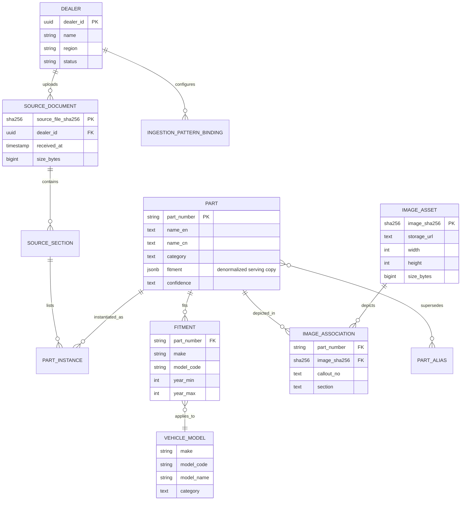

# Data Architecture — canonical model, ownership, classification, lineage

> The senior critique I anticipate: *"the JSONB serving column is fine, but where's the formal data architecture?"* This document is that answer.

I treat data architecture as three distinct layers that often get conflated:

1. **Conceptual model** — what business entities exist and how they relate
2. **Logical model** — how those entities are structured for *each access pattern* (serving, canonical, analytics)
3. **Physical model** — the concrete tables, columns, indexes, and constraints

Most submissions only show one logical view. That's where the panel question comes from. Below is the full picture.

---

## Conceptual model — the business entities



The eleven entities (`Dealer`, `SourceDocument`, `SourceSection`, `Part`, `PartInstance`, `Fitment`, `VehicleModel`, `ImageAsset`, `ImageAssociation`, `PartAlias`, `IngestionPatternBinding`) cover every concept the brief implies plus the multi-OEM future the brief points at.

---

## Logical model — three shapes for three access patterns

A single physical schema cannot win on all three of these access patterns. So the architecture explicitly carries **multiple logical shapes** of the same conceptual entities:

### Shape A — Serving (denormalized, marketplace-facing)

**Optimised for:** `WHERE fitment @> '[{"make":"Kayo","model_code":"AT125-B"}]'` containment queries on hot-path catalog reads.

```
products (
  part_number PK, name_en, name_cn, category,
  fitment jsonb,                   -- denormalized array
  data_quality, confidence,
  source_dealer_id, source_file_sha256
)
WITH INDEX products_fitment_path_ops_idx ON GIN (fitment jsonb_path_ops)
```

This is the shape Solution A ships. Right for **point-lookup marketplace queries**. Wrong for cross-product analytics.

### Shape B — Canonical (normalized, governance-facing)

**Optimised for:** referential integrity, dealer-supplied data corrections, fitment write paths, supersession chains.

```
parts (part_number PK, name_en, name_cn, category, confidence)
fitments (part_number FK, make, model_code, year_min, year_max,
          variant, section, callout_no, source_run_id)
vehicle_models (make PK, model_code PK, model_name, category)
part_aliases (old_part_number FK, new_part_number FK, supersession_reason)
```

This shape exists in Solution A as **derived/materialised**:
- `vehicle_models` table is `SELECT DISTINCT ... FROM products, jsonb_to_recordset(fitment)`
- `part_number_aliases` is its own canonical table from the engine sheets

The fitments-as-rows shape is not materialised in Solution A because the read path doesn't need it. It would be materialised when:
- Cross-fitment analytics queries (`how many parts fit any Kayo 2018-2020 model?`) become hot
- The data-governance team needs row-level edit access
- The supersession chain analysis becomes a recurring report

### Shape C — Analytics (wide, OLAP-facing)

**Optimised for:** `SELECT COUNT(*), SUM(*) GROUP BY make, year_bucket` aggregate queries. Wide fact tables.

```
fact_part_fitment (
  part_id, dealer_id, make, model_code, year, category_id,
  has_schematic, schematic_image_count, source_run_id,
  ingested_date_id, valid_from, valid_to
)
WITH dimensions dim_part, dim_dealer, dim_vehicle, dim_date
```

Solution A doesn't ship this. Solution B (Iceberg medallion) carries this in the Gold layer. Solution C (Microsoft Fabric) carries this in the Warehouse + semantic model. The transition trigger is when analytics traffic > 30% of catalog API traffic.

### Why three shapes — and why this isn't over-engineering

Every architecture I've worked on has tried to pick *one* shape and force the other use cases through it. It always fails. **Serving and canonical and analytics have inherently incompatible access pressures** — denormalising for one penalises the others. The mature pattern is to:

1. Pick the dominant access pattern → physical store
2. Materialise the other shapes from it as derived views (or carry them in separate stores)
3. Document the boundaries explicitly so no one accidentally writes a 5-table join against the serving table

This document is the boundary statement.

---

## Physical model — what Solution A ships today

| Table | Purpose | Shape | Rows (measured) |
|---|---|---|---|
| `products` | Serving (denormalized) | A | ~4,000 per dealer |
| `product_images` | Image associations | A | ~10,500 per dealer |
| `image_callouts` | Vision OCR output | A (extended) | ~200 per dealer (partial coverage today) |
| `vehicle_models` | Canonical-lite | B (derived) | 65 across the test dataset |
| `part_number_aliases` | Canonical | B | 50 OLD↔NEW pairs |
| `reference_specs` | Catch-all reference sheets | A | ~700 per dealer |
| `dealers` | Tenant | — | 1+ |
| `ingestion_patterns` | MDCP registry | — | 3 (one per header signature) |
| `dealer_pattern_bindings` | MDCP per-dealer config | — | per dealer × pattern |
| `ingest_audit` | Operational lineage | — | one row per LLM call |
| `ingest_runs` | Operational lineage | — | one row per dealer-file run |
| `stream_events` | Streaming outbox source | — | event-volume |
| `stream_outbox` | Streaming outbox | — | event-volume |

13 tables. Indexes: GIN on `fitment` (path_ops), B-tree on every foreign key, partial indexes on `data_quality = 'high'` for the marketplace-fast path.

---

## Data ownership and stewardship

A senior architect doesn't ship a data model without naming who owns what. **Data ownership is engineering culture, not a tool feature.**

| Entity | Owner | Steward | Approval flow |
|---|---|---|---|
| `dealers` (the tenant record) | Operations | Account manager | New dealer added via registry insert + manual approval |
| `ingestion_patterns` (header signature definitions) | Data Engineering | Senior parser engineer | Code review on `src/parse/section-detect.ts` |
| `dealer_pattern_bindings` | Operations + DE | Account manager + DE | Auto-derived for known signatures; manual for new patterns |
| `products.name_en`, `name_cn` (source of truth) | Dealer-supplied | Operations review queue | Dealer's value writes through; flagged for review on LLM disagreement |
| `products.name_en_llm` (LLM-derived) | LLM provider | Audit reviewer | Read-only output of `ingest_audit` |
| `vehicle_models` | Derived (no owner) | DE | Materialized post-ingest; not directly editable |
| `image_callouts` | Vision LLM derived | Audit reviewer | OCR output; can be corrected via review queue |
| `part_number_aliases` | Dealer-supplied (engine sheets) | Senior parser engineer | Source-of-truth is dealer's OLD/NEW pairs |
| `ingest_audit`, `ingest_runs` | System-generated, immutable | DataOps | Append-only; no UPDATE/DELETE without explicit migration |

### What the **review queue** does (designed, deferred)

When `ingest_audit.agreement == 'disagree'` and the row is bound for a marketplace listing, the disagreement enters a `review_queue`. A human reviewer sees:

- Original dealer English
- LLM English  
- Chinese source
- Schematic image
- Confidence score
- Cohort signal (does this disagreement appear in N other products?)

Reviewer picks one. Choice updates `cache_overrides` so future runs get the corrected output. Cohort-level corrections propagate.

This is the canonical pattern from my Ashley Furniture work. The InventoryFlow review queue is designed (`review_queue`, `review_decisions`, `cache_overrides` table shapes documented) but not built until marketplace integration ships.

---

## Data classification

Every column belongs to a class. The class drives encryption, retention, access control, and deletion policy.

| Class | Examples | Storage | Access | Retention |
|---|---|---|---|---|
| **P0 — Public catalog data** | `products.name_en`, `fitment` JSONB content, schematic images in R2 | Standard | All authenticated callers | Indefinite while dealer active |
| **P1 — Dealer-supplied IP** | Raw dealer xlsx file (`source_file_sha256`), part_number lists | R2 with dealer-prefix isolation | Dealer + InventoryFlow ops | 7 years (regulatory) |
| **P2 — Operational / audit** | `ingest_audit`, `ingest_runs`, LLM call records | Postgres | DataOps + on-call only | 2 years rolling |
| **P3 — Supplier-confidential commercial data** | `products.dealer_cost`, `products.retail_price` (already in the Solution A schema); future MOQ, supply contracts | Postgres with **column-level access policy** (see [`17-architecture-truth-table.md`](./17-architecture-truth-table.md)) | Dealer-admin + ops_admin; **not** exposed to marketplace_read role | per-contract; default 7 years |
| **P4 — PII** | Dealer admin user identities, account contacts | (not in product schema; lives in IAM) | Restricted | per-GDPR / per-region |

**Pricing fields (`dealer_cost`, `retail_price`) are classified P3 in this submission.** They exist in the Solution A schema today (migration `0000`) for demo coverage. **The column-level access policy that restricts them from the marketplace_read role is documented as a production target — deferred** in the truth table; in the demo, role separation isn't yet wired so any caller can read them. See [`17-architecture-truth-table.md`](./17-architecture-truth-table.md) for the explicit status. When real customer rollout begins, the access path is: drop `dealer_cost`+`retail_price` from the default `GET /api/products` projection; require an explicit `?include=pricing` flag with role-based authorisation; audit every access via `ingest_audit`.

**P4 (true PII) is not in the product schema today.** When dealer admin user identities are added, they get separate tables + Postgres Row Level Security policies + per-tenant encryption keys.

---

## Retention policy

| Layer | Retention | Trigger | Storage destination |
|---|---|---|---|
| **Raw dealer file** (`shared/sample-data/*.xlsx`) | 7 years (audit requirement) | `source_file_sha256` in `ingest_runs` | R2 archive bucket with object lock |
| **Parsed product rows** (`products`) | Indefinite while dealer active; 90 days after dealer deactivation | `dealers.deactivated_at` | Postgres → Iceberg cold storage |
| **`ingest_audit`** (LLM calls) | 2 years rolling | `created_at < NOW() - INTERVAL '2 years'` | Postgres partition drop |
| **`ingest_runs`** (run history) | 7 years | Compliance | Postgres → S3 Glacier monthly |
| **`stream_events`** | 30 days hot, 7 years archived | Outbox-drained flag | Postgres → R2 monthly |
| **`image_callouts`** | Indefinite | Tied to `image_sha256` lifecycle | Postgres |
| **R2 schematic images** | Indefinite during dealer-active; deleted on hard-delete request | Per-dealer prefix lifecycle policy | R2 |
| **LLM cache** (`llm-cache.jsonl`) | Indefinite during prompt-template-version compatible | `prompt_template_ver` change | Git-committed; expires at major version bump |

**The retention bar is set by audit/compliance, not by storage cost.** Storage cost at this scale is sub-$10/month even for 7 years of history; the deletion cost of getting it wrong (regulator asking for source xlsx, marketplace customer asking why their listing changed) is much higher.

---

## Lineage — executable, not decorative

A lineage diagram on a slide is decoration. **Executable lineage** means I can answer "where did this value come from?" with a SQL query, not a guess. Here's the chain for any field in `products`:

```mermaid
flowchart LR
    XLSX[source xlsx file<br/>sha256: abc...] --> SHEET[sheet name + row index<br/>via ingest_runs]
    SHEET --> CELL[cell row + column<br/>via ingest_audit.input_sha256]
    CELL --> PRODUCT[products.part_number<br/>+ source_file_sha256<br/>+ source_sheet<br/>+ source_row_index]
    PRODUCT --> AUDIT[ingest_audit row<br/>per-field LLM call]
    AUDIT --> API[/api/products/:id/ response]
    XLSX -.image anchor.-> IMG[xl/drawings/drawingN.xml]
    IMG --> R2[R2 object<br/>sha256/.../*.jpg]
    R2 --> ASSOC[image_callouts.image_sha256]
```

Every `products` row carries `source_file_sha256`, `source_sheet`, `source_row_index`. Every `ingest_audit` row carries `run_id` linking back to `ingest_runs.run_id` which carries `source_file_sha256`. From any catalog API response, I can trace back to the exact cell of the exact xlsx that produced it.

**This is the senior-engineering discipline that I've found makes the difference between "the system is fine" and "the system is debuggable in a production incident".** Lineage isn't a diagram in a doc — it's a guarantee on every row in every table.

### Lineage at Solution B (Iceberg + OpenLineage)

Solution B extends this to **column-level lineage** via Dagster OpenLineage events: every silver `dbt` model emits an event recording "column X of silver_parts derives from column Y of bronze_kayo_rows via op Z". The lineage becomes a navigable graph in Dagster's UI.

Solution A's lineage is row-level; that's sufficient for sub-100-dealer scale. Column-level lineage becomes necessary when:
- Dealer count > 100 (different schemas + variant pipelines)
- Schema change cadence > 1/week (need to find which downstream broke)
- Multiple consumers of the same column with different transformation history

When that fires, the migration to Solution B is in the operations doc.

---

## What I'd add for full enterprise data governance

Documented as deferred work:

1. **Data dictionary as committed artifact** — schema annotations published as machine-readable YAML; auto-rendered into the public catalog API documentation. Solution A's ADRs cover the *why*; a dictionary would cover the *what* per-field.
2. **Schema registry (Confluent or equivalent)** — for the streaming plane. Today the `stream_events.payload` is JSONB-typed; a schema registry enforces evolution rules cross-tenant.
3. **Data product contracts** — formal interface contracts between the catalog producer (this ingestion system) and consumers (marketplace, BI). Versioned, SemVer'd, breaking-change-flagged.
4. **OpenLineage events** — Solution B carries these for free; retrofitting onto Solution A is a 1-week project worth doing at year 1 in production.
5. **Data quality SLA per source** — per-dealer SLAs on `data_quality` field distribution (e.g., "95% of rows from dealer X must be `data_quality = 'high'`"). Today we have the field; we don't have the per-source SLA bar.

Each has a re-visit trigger in [`08-operations.md`](./08-operations.md).

---

**Next:** [11-security-architecture.md](./11-security-architecture.md) — IAM, tenant isolation, threat model.
