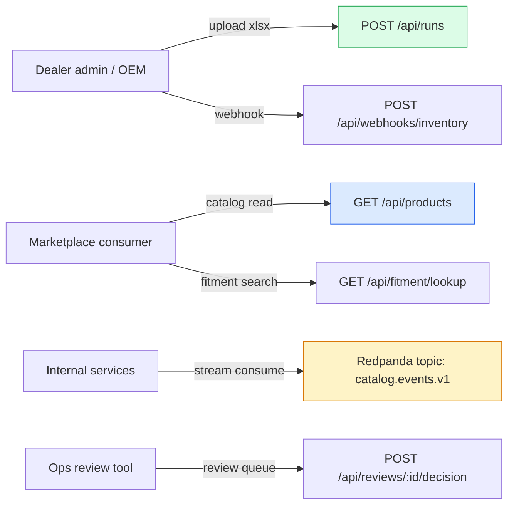

# Integration Contracts — APIs, schemas, sample payloads

> The senior critique I anticipate: *"you describe integration but where are the actual contracts?"* This document is that answer.

I treat every integration surface as a **versioned contract**, not a narrative. Each contract declares its schema, its versioning policy, its compatibility rules, and its sample payloads.

---

## Integration surface map



Six contract surfaces. Below: schema + sample + versioning for the four most load-bearing.

---

## Contract 1 — Ingest run kickoff (`POST /api/runs`)

The endpoint a dealer admin (or automated upload) calls to start ingesting an xlsx file. Multipart upload + JSON metadata.

### Request schema (OpenAPI 3.1 fragment)

```yaml
post:
  /api/runs:
    summary: Start an ingest run from a dealer file
    requestBody:
      content:
        multipart/form-data:
          schema:
            type: object
            required: [file, dealer_id, file_format]
            properties:
              file:
                type: string
                format: binary
                description: The xlsx/csv/pdf file
              dealer_id:
                type: string
                format: uuid
              file_format:
                type: string
                enum: [xlsx, csv, pdf, json]
              ingestion_pattern_hint:
                type: string
                description: Optional override for MDCP dispatch
              dry_run:
                type: boolean
                default: false
    responses:
      '202':
        description: Run accepted
        content:
          application/json:
            schema: { $ref: '#/components/schemas/RunAccepted' }
      '400': { $ref: '#/components/responses/BadRequest' }
      '409':
        description: Same file SHA-256 already ingested (idempotent)
```

### Sample request

```http
POST /api/runs HTTP/1.1
Content-Type: multipart/form-data; boundary=---x
Authorization: Bearer eyJhbG...

-----x
Content-Disposition: form-data; name="dealer_id"

7f71fb5b-f113-4bd7-8104-a6fa04affb20
-----x
Content-Disposition: form-data; name="file_format"

xlsx
-----x
Content-Disposition: form-data; name="file"; filename="catalog.xlsx"
Content-Type: application/vnd.openxmlformats-officedocument.spreadsheetml.sheet

[binary xlsx bytes]
-----x--
```

### Sample response (202 Accepted)

```json
{
  "run_id": "3966427c-cde1-4922-b957-d6f29ccd6a99",
  "status": "queued",
  "source_file_sha256": "abc1234567890def...",
  "estimated_completion_seconds": 60,
  "events_url": "/api/events/3966427c-cde1-4922-b957-d6f29ccd6a99",
  "self_url": "/api/runs/3966427c-cde1-4922-b957-d6f29ccd6a99"
}
```

### Versioning policy

- Path versioning: `/api/v1/runs` for breaking changes
- Field additions are backward-compatible; field removals are MAJOR
- `Sunset` header announces deprecation 90 days ahead
- Idempotent on `source_file_sha256` — same file gets the same `run_id` (409 with prior `run_id` in body)

---

## Contract 2 — Catalog product read (`GET /api/products`)

The hot-path query for marketplace consumers. The contract the brief most pointedly tests.

### Sample response (one product)

```json
{
  "part_number": "AT125-B-001",
  "name_en": "Front Wheel Hub",
  "name_cn": "前轮毂",
  "category": "WHEELS_TIRES",
  "data_quality": "high",
  "confidence": "high",
  "fitment": [
    {
      "year": 2016, "make": "Kayo", "model": "Predator 125",
      "model_code": "AT125-B", "variant": null,
      "category": "SPORT_ATV",
      "section": "Front Wheel Assembly", "callout_no": "1-1",
      "confidence": "high"
    },
    {
      "year": 2017, "make": "Kayo", "model": "Predator 125",
      "model_code": "AT125-B", "variant": null,
      "category": "SPORT_ATV",
      "section": "Front Wheel Assembly", "callout_no": "1-1",
      "confidence": "high"
    }
  ],
  "images": [
    {
      "image_sha256": "sha256:abc...",
      "url": "https://catalog.inventoryflow.example/sha256/ab/c0/...jpg",
      "url_expires_at": "2026-05-13T12:00:00Z",
      "callouts": [
        { "n": 1, "pos": "top-left" },
        { "n": 2, "pos": "center" }
      ]
    }
  ],
  "lineage": {
    "source_file_sha256": "def...",
    "source_sheet": "Predator 125 Body",
    "source_row_index": 23,
    "ingest_run_id": "3966427c-cde1-4922-b957-d6f29ccd6a99",
    "last_updated_at": "2026-05-12T09:23:45Z"
  }
}
```

### Query patterns supported

| Query | Endpoint | Index used |
|---|---|---|
| Get single product | `GET /api/products/:part_number` | PK |
| List products by dealer | `GET /api/products?dealer_id=X` | dealer_id + RLS |
| Fitment containment | `GET /api/fitment/lookup?make=Kayo&model_code=AT125-B` | GIN `jsonb_path_ops` on fitment |
| Full-text on name | `GET /api/products?q=brake` | trigram index on name_en/name_cn |
| Images for product | `GET /api/products/:pn/images` | FK + signed URL middleware |

---

## Contract 3 — Streaming events (Redpanda topic `catalog.events.v1`)

Event-carried state transfer for downstream consumers (marketplace sync, BI ingest, customer notification).

### Event envelope (AsyncAPI 3.0 fragment)

```yaml
channels:
  catalog.events.v1:
    address: catalog.events.v1
    messages:
      ProductChanged:
        contentType: application/json
        payload:
          $ref: '#/components/schemas/ProductChangedEvent'
        traits:
          - $ref: '#/components/messageTraits/EventEnvelope'

components:
  messageTraits:
    EventEnvelope:
      headers:
        type: object
        required: [event_id, event_type, version, occurred_at, dealer_id]
        properties:
          event_id:        { type: string, format: uuid }
          event_type:      { type: string, enum: [product.changed, image.uploaded, audit.disagreement, run.completed] }
          version:         { type: string, pattern: '^v[0-9]+(\.[0-9]+)?$' }
          occurred_at:     { type: string, format: date-time }
          dealer_id:       { type: string, format: uuid }
          source_run_id:   { type: string, format: uuid }
          correlation_id:  { type: string, format: uuid }
```

### Sample event — `product.changed`

```json
{
  "headers": {
    "event_id": "e8a45c01-...",
    "event_type": "product.changed",
    "version": "v1",
    "occurred_at": "2026-05-13T12:34:56Z",
    "dealer_id": "7f71fb5b-...",
    "source_run_id": "3966427c-...",
    "correlation_id": "trace-abc-123"
  },
  "payload": {
    "part_number": "AT125-B-001",
    "change_type": "upsert",
    "fields_changed": ["name_en", "fitment"],
    "previous_data_quality": "medium",
    "new_data_quality": "high"
  }
}
```

### Delivery semantics

| Property | Value |
|---|---|
| Ordering | Per-dealer (partition key = `dealer_id`) |
| Delivery | At-least-once |
| Dedup key | `event_id` (consumer must dedupe) |
| Retention | 7 days hot, 7 years archived |
| Schema evolution | Backward-compatible additions only; breaking change = new topic version `catalog.events.v2` |

Consumers register via consumer group; we do not push.

---

## Contract 4 — Dealer onboarding runbook

When InventoryFlow signs a new dealer, the engineering onboarding checklist:

| Step | Owner | Artifact produced | Time |
|---|---|---|---|
| 1. Create `dealers` row | Ops + DE | `dealer_id` UUID | 5 min |
| 2. Issue API credentials (JWT signing key, R2 prefix) | DE | Credential bundle (in secrets store) | 10 min |
| 3. Receive 3 sample xlsx files | Account manager | Files in dealer-private R2 prefix | depends on dealer |
| 4. Run dry-run ingest on first sample | DE | `ingest_runs.status='dry_run_ok'` | 10 min |
| 5. Identify header signature | DE | If known signature: bind in `dealer_pattern_bindings`; if new: add to `src/parse/section-detect.ts` + write test | 1 h (known) / 1 day (new) |
| 6. Run first production ingest | DE | `products` rows + sample queries verified | 30 min |
| 7. Marketplace consumer SDK integration check | DE + marketplace team | `GET /api/products?dealer_id=X` returns expected shape | 30 min |
| 8. Set up dealer-specific monitoring | DE | Datadog/Grafana dealer panel | 30 min |
| 9. First-week SLO baseline collection | DE | Per-dealer SLI baseline in `ingest_audit` | 1 week passive |
| 10. Sign off on production cutover | Account manager + DE | `dealers.activated_at` | 5 min |

**Total day-1 effort with known signature: ~3 hours of DE time + 1 week of passive baseline collection.**
**With a new signature: +1 day for parser + test.**

---

## Schema evolution rules

Per-contract policy committed in writing:

### REST API (`/api/*`)

- **Add a field** → no version bump
- **Remove a field** → MAJOR (`/api/v2`); 90-day deprecation with `Sunset` header
- **Change field meaning** → MAJOR
- **Add new endpoint** → no version bump
- **Remove endpoint** → MAJOR

### Streaming events

- **Add a header** → no version bump
- **Add a payload field** → no version bump
- **Remove or rename** → new topic version
- **Change semantic** → new topic version

### Database schema (internal contract with our own services)

- **Add column** → migration, backward compat
- **Drop column** → 2-stage: stop writing → wait for consumers → drop
- **Rename column** → 3-stage view migration
- **Drop table** → 30-day deprecation notice + audit

### LLM prompt templates

- `prompt_template_ver` in cache keys is the version
- Minor edit (typo fix) → no version bump; cache stays valid
- Semantic change (different output shape) → version bump; cache rebuild offline before deploy

---

## What's NOT in the contract package yet (and the trigger to add)

| Item | Trigger to add |
|---|---|
| OpenAPI YAML committed in repo + auto-served from `/api/openapi.yaml` | First external integration partner |
| AsyncAPI YAML committed | First downstream consumer of `catalog.events.v1` |
| Generated client SDKs (TS, Python) | First customer asking |
| Webhook signing for dealer-side webhooks | First dealer with webhook integration |
| Mutual TLS for partner-to-partner | First enterprise customer requiring it |
| GraphQL fed gateway over the REST API | When multi-source aggregation > 3 sources |

---

**Back to:** [README](../README.md) · [02-solution-A-recommended](./02-solution-A-recommended.md) · [10-data-architecture](./10-data-architecture.md)
